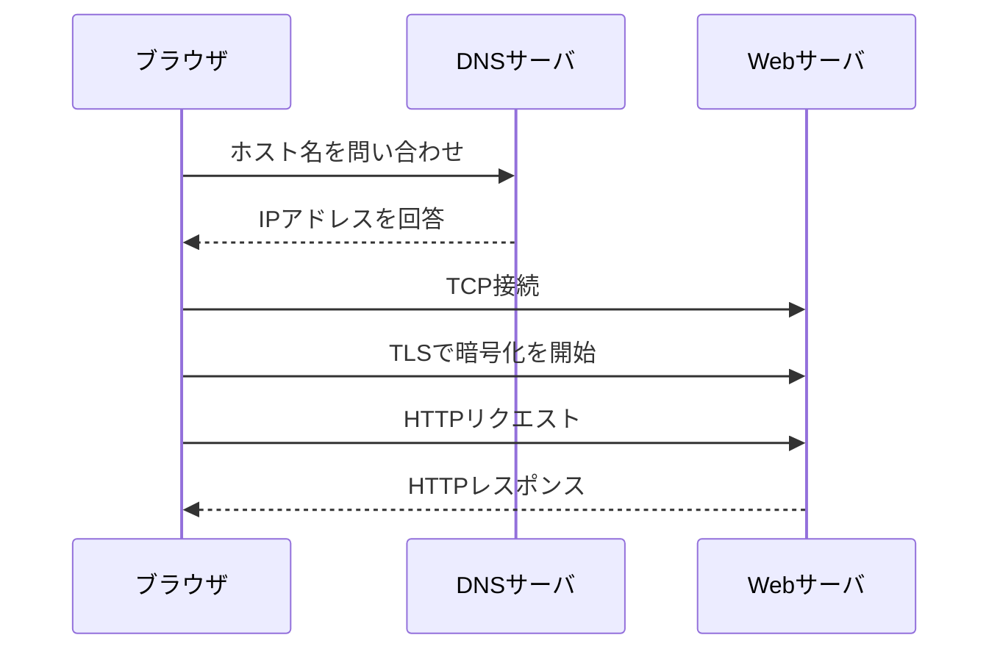

# 第02章 データはどう届くのか

**― Webページが表示されるまでを追いかける ―**

> この章では、ブラウザにURLを入力してから画面が表示されるまでをたどり、複数の技術がどのように連携するかを学びます。

------------------------------------------------------------------------

# 1. この章で学べること

- データが小さな単位に分割されて届く理由
- DNS、IP、TCP、TLS、HTTPのおおまかな役割
- 送信元から宛先までに機器や回線をまたぐ流れ
- Linuxで通信の各段階を確認する方法

# 2. この章の位置付け

第1章ではネットワーク全体の地図を作りました。本章では、その地図の上で一つの通信を動かします。各技術の詳細を先に覚えるのではなく、まず一連の流れをつかむことが目的です。

# 3. なぜデータを届ける仕組みが必要になったのか

一本の専用線で二台だけを接続するなら、信号をそのまま送ることもできます。しかし、多数の利用者が同じ回線を共有し、異なるメーカーの機器を経由して世界中と通信するには、宛先、順序、誤りの検出などを共通の方法で扱う必要があります。

そこでデータを扱いやすい単位に分け、宛先などの制御情報を付け、複数の機器が順番に転送する仕組みが発達しました。

# 4. 通信の全体像

ブラウザで `https://www.example.com/` を開く場合、代表的には次の処理が行われます。

1. **DNS（Domain Name System）**でホスト名をIPアドレスへ変換します。
2. 宛先が別ネットワークなら、ルータへデータを渡します。
3. **TCP（Transmission Control Protocol）**で相手と接続し、信頼性のある通信路を作ります。
4. HTTPSでは**TLS（Transport Layer Security）**で相手を確認し、通信を暗号化します。
5. **HTTP（Hypertext Transfer Protocol）**でWebページを要求し、応答を受け取ります。
6. ブラウザがHTMLなどを解釈して画面を描画します。



# 5. 詳しい仕組み

## データは分割して送る

大きなデータを一度に回線へ流すと、ほかの通信が長時間待たされ、誤りがあった場合の再送量も増えます。そのため、ネットワークではデータを小さな単位に分割します。この単位を一般に**パケット（Packet）**と呼びます。詳しい構造は第6章で扱います。

## ヘッダを付ける

分割したデータには、宛先や送信元などを記録した**ヘッダ（Header）**を付けます。配送伝票が荷物の届け先を示すように、ネットワーク機器はヘッダを見て処理を判断します。

## 中継しながら届ける

異なるネットワークへ進むときは、**ルータ（Router）**が次の転送先を選びます。一回の通信でも複数のルータを通ることがあります。各ルータは最終経路全体ではなく、自分が次に渡す相手を判断します。

## 受信側で元に戻す

受信側はヘッダを解釈し、適切なアプリケーションへデータを渡します。TCPを使う場合は、抜けや順序の入れ替わりを検出し、アプリケーションから見て連続したデータとして扱えるようにします。

# 6. Linuxではどうなるか

次のコマンドは、通信の異なる段階を確認します。

```bash
# DNSによる名前解決
getent hosts www.example.com

# 宛先までのIP疎通（相手が応答を許可している場合）
ping -c 4 www.example.com

# HTTPSの要求と応答ヘッダを確認
curl -I https://www.example.com/

# 現在のTCP/UDPソケットを確認
ss -tun
```

`ping` が失敗しても、相手がICMPを遮断しているだけでWeb通信は成功する場合があります。一つのコマンドだけで「ネットワーク全体が故障した」と判断しないことが重要です。

# 7. 実務ではどう使われるか

## 実務コラム：Webサイトが開かない

「サイトが開かない」という現象でも、原因はDNS、経路、TCP、TLS、HTTP、アプリケーションのどこにでもあります。

```bash
getent hosts service.example.com
ip route get 192.0.2.10
curl -v https://service.example.com/
```

`curl -v` の出力で、名前解決、接続、TLS、HTTP応答のどこまで進んだかを確認できます。実務では、失敗した段階を特定してから担当者や設定を絞り込みます。

# 8. FE/APではどう問われるか

DNSによる名前解決、TCP接続、HTTPSにおけるTLS、ルータによるパケット転送の順序と役割が問われます。各用語を単独で覚えるのではなく、「どの段階で何を解決するか」を説明できるようにします。

# 9. まとめ

- 通信は複数のプロトコルと機器の協調で成立します。
- データは分割され、ヘッダを付けて中継されます。
- 障害調査ではDNS、経路、接続、暗号化、アプリケーションの順に段階を確認します。

# 10. 理解度チェック

1. データを小さく分割する利点を二つ説明してください。
2. DNS、TCP、TLS、HTTPはそれぞれ何を担当しますか。
3. `ping` が失敗してもWebサイトが開く場合があるのはなぜですか。

# 11. 解答・解説

## 問1

回線を複数の通信で共有しやすくなり、誤りがあった場合に必要な部分だけを再送できます。機器ごとに扱えるデータサイズへ合わせられる利点もあります。

## 問2

DNSは名前をIPアドレスへ変換し、TCPは信頼性のある通信路を作り、TLSは相手確認と暗号化を行い、HTTPはWebの要求と応答を定めます。

## 問3

`ping` が使うICMPだけがFirewallなどで遮断され、HTTPSに使うTCP通信は許可されている場合があるためです。

# 12. 実務で考えてみよう

## ケース：IPアドレスでは接続できるが名前では接続できない

### 解答例

通信経路やWebサーバよりも、DNS設定、DNSサーバへの到達性、検索ドメイン、誤ったキャッシュを優先して確認します。`getent hosts` と `/etc/resolv.conf` を確認し、IPアドレス指定時との差を記録します。

# 13. 次章へのつながり

次章では、通信処理を役割ごとの層に分けて考えるOSI参照モデルを学び、障害箇所を整理する共通のものさしを作ります。

------------------------------------------------------------------------

# レビュー状況（執筆メモ）

- 執筆：完了
- レビュー①（章レビュー）：未実施
- レビュー②（部レビュー）：第1部完成後に実施予定
