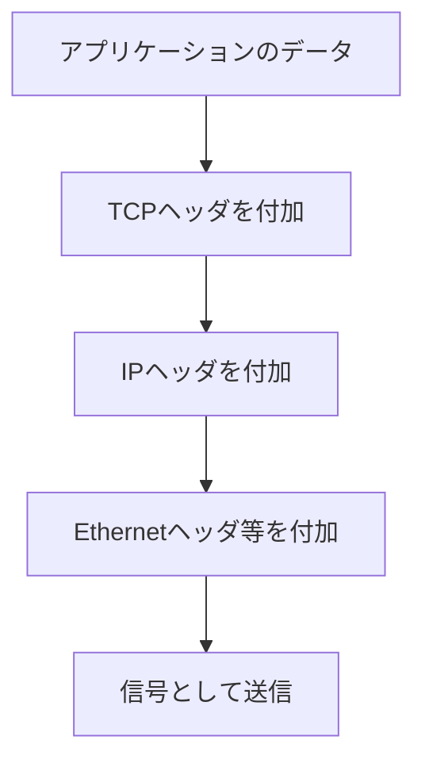

# 第03章 OSI参照モデル

**― 複雑な通信を七つの役割に分ける ―**

> この章では、ネットワーク通信を層ごとに整理するOSI参照モデルと、障害切り分けへの使い方を学びます。

------------------------------------------------------------------------

# 1. この章で学べること

- OSI参照モデルが作られた背景
- 七つの層の役割と代表例
- カプセル化と非カプセル化の考え方
- 実務で層を使って障害を切り分ける方法

# 2. この章の位置付け

第2章で見た一連の通信を、役割ごとに整理します。OSI参照モデルは実装そのものではなく、技術や障害を説明するための共通のものさしです。

# 3. なぜOSI参照モデルが必要になったのか

ネットワークの初期には、メーカーごとに独自方式があり、異なる機器を接続しにくい問題がありました。また、通信のすべてを一つの仕組みとして作ると、変更の影響範囲が大きくなります。

そこで通信機能を役割別に分け、各層の境界を明確にする考え方が必要になりました。**OSI参照モデル（Open Systems Interconnection Reference Model）**は、通信機能を七つの層で整理した概念モデルです。

# 4. 七つの層

| 層 | 名称 | 主な役割 | 代表例 |
|---:|---|---|---|
| 7 | アプリケーション層 | 利用者に近い通信サービス | HTTP、DNS、SMTP |
| 6 | プレゼンテーション層 | データ形式、暗号化、圧縮 | 文字コード、暗号化 |
| 5 | セッション層 | 通信の開始・維持・終了 | セッション管理 |
| 4 | トランスポート層 | 端末間の配送、信頼性 | TCP、UDP |
| 3 | ネットワーク層 | ネットワーク間の配送 | IP、ルータ |
| 2 | データリンク層 | 同一リンク内の配送 | Ethernet、MACアドレス、スイッチ |
| 1 | 物理層 | ビットを信号として伝送 | ケーブル、電波、コネクタ |

上位層ほどアプリケーションに近く、下位層ほど物理的な伝送に近づきます。実際のプロトコルが一つの層へ完全に収まらない場合もあります。

# 5. 詳しい仕組み

## 層に分ける利点

各層が決められた役割と境界を持つことで、下位の伝送方式が有線から無線へ変わっても、上位のWebアプリケーションを作り直さずに済みます。また、障害を「物理層か、IPの層か、アプリケーション層か」と絞れます。

## カプセル化

送信時に上位層のデータへ各層の制御情報を順番に付けることを**カプセル化（Encapsulation）**と呼びます。受信側で制御情報を順に外す処理は非カプセル化です。



層ごとにデータ単位の名称があります。トランスポート層ではセグメント、ネットワーク層ではパケット、データリンク層ではフレームと呼ぶのが代表的です。文脈によって「パケット」を広い意味で使う場合もあります。

# 6. Linuxではどうなるか

Linuxでは複数のコマンドを組み合わせ、層ごとに状態を確認します。

```bash
# 物理層・データリンク層に近い状態
ip -s link

# ネットワーク層のアドレスと経路
ip address
ip route

# トランスポート層のソケット
ss -lntup

# アプリケーション層のHTTP応答
curl -I https://www.example.com/
```

代表的な出力例（必要な部分のみ抜粋）

```text
$ ip -s link show dev eth0
2: eth0: <BROADCAST,MULTICAST,UP,LOWER_UP> mtu 1500 ...
    RX: bytes  packets  errors  dropped
        84521      620       0        0
    TX: bytes  packets  errors  dropped
        60112      508       0        0

$ ip address show dev eth0
    inet 192.0.2.10/24 scope global eth0

$ ip route
default via 192.0.2.1 dev eth0

$ ss -lnt
State  Local Address:Port
LISTEN 0.0.0.0:22

$ curl -I https://www.example.com/
HTTP/2 200
```

確認ポイント

- `LOWER_UP` は物理リンクが利用可能であること、`errors` と `dropped` は送受信時の異常や破棄数を示します。
- `inet` がIPv4アドレス、`/24` がプレフィックス長です。
- `default via` の後ろがデフォルトゲートウェイです。
- `LISTEN` はアプリケーションが接続を待ち受けている状態です。
- HTTPステータスまで返れば、少なくとも下位層からアプリケーション層まで通信が進んだと判断できます。

`ip -s link` のエラーやドロップが増えていれば下位層を疑い、TCP接続までは成功してHTTPエラーが返るなら上位層を疑います。

# 7. 実務ではどう使われるか

## 実務コラム：「ネットワークが遅い」を分解する

ケーブル不良、インターフェースのエラー、経路の混雑、TCP再送、DNS応答遅延、サーバ処理遅延は、利用者からはすべて「遅い」と見えます。

OSI参照モデルを使い、リンク統計、経路、TCP状態、アプリケーション応答時間の順に確認すると、調査の抜けや思い込みを減らせます。ただし、必ず第1層から固定順で調べるのではなく、観測事実から可能性の高い層を選びます。

# 8. FE/APではどう問われるか

各層の役割、機器、プロトコル、データ単位の対応が問われます。表を丸暗記するだけでなく、「ルータは異なるネットワーク間でIPパケットを転送するため第3層」と理由を説明できることが重要です。

# 9. まとめ

- OSI参照モデルは通信機能を七層に整理する概念モデルです。
- 層分けにより、技術の交換や障害切り分けがしやすくなります。
- 送信時にはカプセル化、受信時には非カプセル化が行われます。

# 10. 理解度チェック

1. OSI参照モデルでルータとスイッチは主に何層で動作しますか。
2. カプセル化とは何ですか。
3. HTTP応答が `500` の場合、最初にどの層を疑いますか。

# 11. 解答・解説

## 問1

ルータは主に第3層、スイッチは主に第2層です。多層の機能を持つ製品もあるため、機器名だけでなく実際の処理で判断します。

## 問2

送信データに、TCP、IP、Ethernetなど各層の制御情報を順番に付ける処理です。

## 問3

HTTPの `500 Internal Server Error` が返っているため、通信路はHTTP応答を受け取れるところまで動いています。まずアプリケーション層やサーバ内部を確認します。

# 12. 実務で考えてみよう

## ケース：リンクはUPだが別ネットワークへ届かない

### 解答例

第1・第2層の接続は成立している可能性があります。IPアドレス、サブネット、デフォルトゲートウェイ、ルーティングテーブルを `ip address` と `ip route` で確認し、第3層の設定を切り分けます。

# 13. 次章へのつながり

次章では、実際のインターネットで広く使われるTCP/IPモデルを学び、OSI参照モデルとの対応と違いを整理します。

------------------------------------------------------------------------

# レビュー状況（執筆メモ）

- 執筆：完了
- レビュー①（章レビュー）：未実施
- レビュー②（部レビュー）：第1部完成後に実施予定
