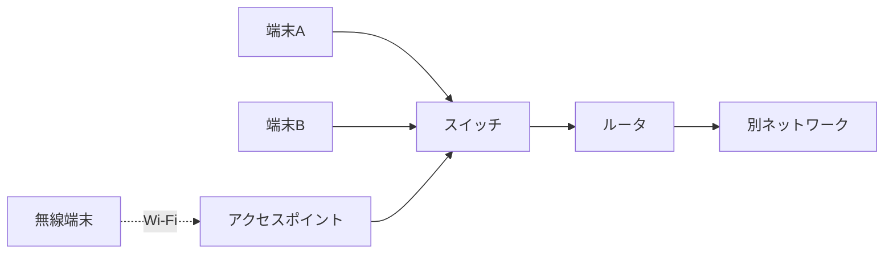

# 第05章 ネットワーク機器

**― データをつなぎ、分け、次へ送る装置 ―**

> この章では、NIC、スイッチ、ルータ、無線LANアクセスポイントなどの役割と、障害時の確認方法を学びます。

------------------------------------------------------------------------

# 1. この章で学べること

- 代表的なネットワーク機器の役割
- スイッチとルータの違い
- 家庭用ルータが複数の機能を持つ理由
- Linuxから接続状態や経路を確認する方法

# 2. この章の位置付け

第4章ではTCP/IPモデルの各層を学びました。本章では、各層の処理を支える物理的・論理的な機器に注目します。

# 3. なぜネットワーク機器が必要になったのか

端末が二台だけなら直接接続できます。しかし台数や距離が増えると、すべての端末を直接つなぐことは現実的ではありません。また、不要なデータを全端末へ送り続けると回線を浪費します。

そこで、同じネットワーク内の転送、異なるネットワーク間の転送、有線と無線の接続などを分担する機器が必要になりました。

# 4. 代表的な機器

## NIC

**ネットワークインターフェースカード（Network Interface Card: NIC）**は、コンピュータをネットワークへ接続するインターフェースです。有線LAN、無線LAN、仮想NICなどがあります。

## スイッチ

**スイッチ（Switch）**は、主に同じLAN内でEthernetフレームを転送する機器です。受信したフレームの送信元MACアドレスを学習し、宛先MACアドレスに対応するポートへ転送します。

## ルータ

**ルータ（Router）**は、異なるIPネットワーク間でパケットを転送する機器です。**ルーティングテーブル（Routing Table）**を参照し、宛先IPアドレスに応じて次の転送先を選びます。

## 無線LANアクセスポイント

**アクセスポイント（Access Point: AP）**は、無線LAN端末を有線LANなどへ接続します。電波を使うため、距離、壁、干渉、認証方式が通信品質と安全性に影響します。

## Firewall

**Firewall（ファイアウォール）**は、送信元、宛先、ポート番号、通信状態などの条件に基づいて通信を許可または遮断します。専用機器だけでなく、ルータ、Linux、クラウド上にも実装されます。

# 5. 詳しい仕組み



端末Aから同じLANの端末Bへ送る場合、主にスイッチが転送します。宛先が別ネットワークなら、端末は**デフォルトゲートウェイ（Default Gateway）**であるルータへ送ります。

実際の製品は複数機能を持つことがあります。家庭用の「Wi-Fiルータ」は、ルータ、スイッチ、アクセスポイント、DHCP、NAT、Firewallなどを一台にまとめたものです。製品名ではなく、今どの機能が働いているかを考えます。

スイッチが宛先MACアドレスをまだ学習していない場合、受信ポート以外へフレームを転送して宛先を探します。この動作を**フラッディング（Flooding）**と呼びます。

# 6. Linuxではどうなるか

```bash
# NICとリンク状態、統計
ip -br link
ip -s link show dev eth0

# IPアドレスとデフォルトゲートウェイ
ip -br address
ip route

# 近隣端末のIPアドレスとMACアドレスの対応
ip neigh

# PCI接続のNICを確認（環境によって要root権限）
lspci -k | grep -A 3 -i ethernet
```

代表的な出力例（必要な部分のみ抜粋）

```text
$ ip -br link
lo      UNKNOWN  <LOOPBACK,UP,LOWER_UP>
eth0    UP       <BROADCAST,MULTICAST,UP,LOWER_UP>

$ ip -s link show dev eth0
    RX: bytes  packets  errors  dropped
       1048576     820       0        2

$ ip -br address
eth0    UP       192.0.2.10/24

$ ip route
default via 192.0.2.1 dev eth0

$ ip neigh
192.0.2.1 dev eth0 lladdr 02:00:5e:10:00:01 REACHABLE

$ lspci -k
02:00.0 Ethernet controller: Example Gigabit Ethernet
        Kernel driver in use: example_nic
```

確認ポイント

- `UP` と `LOWER_UP` は、インターフェースが有効で物理リンクも検出されていることを示します。
- `errors` と `dropped` は受信エラーと破棄数です。継続的に増える場合はNIC、ケーブル、スイッチポートなどを確認します。
- `default via 192.0.2.1` のIPアドレスがデフォルトゲートウェイです。
- `lladdr` の後ろが近隣機器のMACアドレス、`REACHABLE` は到達可能と判断されている状態です。
- `Kernel driver in use` でNICに使用中のドライバを確認できます。

インターフェース名は環境によって `eth0`、`enp1s0`、`wlan0` など異なります。例をそのまま実行せず、`ip -br link` で実際の名前を確認します。

# 7. 実務ではどう使われるか

## 実務コラム：リンクが頻繁に切れる

ケーブル不良、スイッチポート、速度・全二重設定、NICドライバ、電源管理が原因になります。

```bash
ip -s link show dev eth0
ethtool eth0
journalctl -k --since "10 minutes ago"
```

代表的な出力例（障害判断に必要な部分のみ抜粋）

```text
$ ip -s link show dev eth0
    RX: bytes  packets  errors  dropped
       2097152    1640      12        4

$ ethtool eth0
Speed: 1000Mb/s
Duplex: Full
Link detected: yes

$ journalctl -k --since "10 minutes ago"
Jul 17 10:03:11 host kernel: eth0: Link is Down
Jul 17 10:03:14 host kernel: eth0: Link is Up - 1Gbps/Full
```

確認ポイント

- `errors` や `dropped` が調査中も増える場合、物理接続やNIC周辺を疑います。
- `Speed` はリンク速度、`Duplex` は全二重・半二重、`Link detected` はリンク検出状態です。
- ログで `Link is Down` と `Link is Up` が繰り返されていれば、瞬断が発生した時刻を特定できます。

リンクのUP/DOWN時刻、エラーカウンタ、リンク速度を記録し、ケーブルやポートを一つずつ交換して原因を切り分けます。`ethtool` は環境によって管理権限が必要です。

# 8. FE/APではどう問われるか

リピータ、ブリッジ、スイッチ、ルータの役割と対応層、MACアドレス学習、ルーティング、デフォルトゲートウェイが問われます。多機能製品でも、問題文中の処理内容から機能を判断します。

# 9. まとめ

- NICは端末を接続し、スイッチは主に同一LAN内、ルータは異なるIPネットワーク間を転送します。
- アクセスポイントは無線端末をネットワークへ接続します。
- 実際の製品は複数機能を持つため、役割を分けて考えます。

# 10. 理解度チェック

1. スイッチとルータの転送判断の違いを説明してください。
2. デフォルトゲートウェイはいつ使われますか。
3. 家庭用Wi-Fiルータが一台で複数の役割を果たせるのはなぜですか。

# 11. 解答・解説

## 問1

スイッチは主にMACアドレスを見て同一LAN内のフレームを転送し、ルータは宛先IPアドレスとルーティングテーブルを見て異なるネットワークへパケットを転送します。

## 問2

端末が自分と異なるIPネットワークの宛先へ送るとき、最初の転送先として使います。

## 問3

ルータ、スイッチ、アクセスポイントなどの機能を一つの筐体とソフトウェアへ統合しているためです。

# 12. 実務で考えてみよう

## ケース：同じ部署の端末には届くが、インターネットへ出られない

### 解答例

NICとスイッチを経由したLAN内通信は成立していると考えられます。デフォルトゲートウェイ設定、ルータへの到達性、ルータのWAN側、NAT、Firewallを確認します。DNS障害との区別のため、名前とIPアドレスの両方で試します。

# 13. 次章へのつながり

次章では、これらの機器が転送するパケットやフレームの中に、どのような制御情報が入っているかを学びます。

------------------------------------------------------------------------

# レビュー状況（執筆メモ）

- 執筆：完了
- レビュー①（章レビュー）：未実施
- レビュー②（部レビュー）：第1部完成後に実施予定
