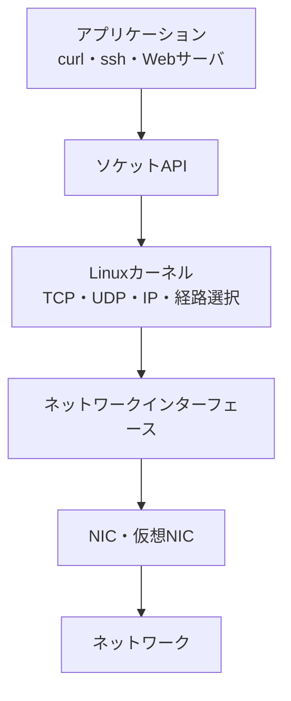

# 第07章 Linuxとの関係

**― 学んだ仕組みをOSの上で確かめる ―**

> この章では、Linuxのネットワークスタック、インターフェース、経路、ソケットを結び付け、基本的な調査手順を学びます。

------------------------------------------------------------------------

# 1. この章で学べること

- Linuxカーネルとアプリケーションの役割分担
- ネットワークインターフェース、経路、ソケットの関係
- Linuxで使う基本的な確認コマンド
- 実務で情報を集め、順序立てて切り分ける方法

# 2. この章の位置付け

第1部で学んだ通信、階層、機器、パケットをLinux上の観測結果へ結び付けます。個別プロトコルの詳しい設定は後続の章で扱い、本章では調査の土台を作ります。

# 3. なぜOSのネットワーク機能が必要になったのか

アプリケーションごとにNICを直接制御し、TCPやIPを独自実装すると、開発量が増え、同じ機能が重複し、安全性や互換性も保ちにくくなります。

Linuxではカーネルがネットワークスタック、経路選択、パケット送受信などを共通機能として提供します。アプリケーションはソケットAPIを使うため、WebサーバもSSHクライアントも同じ基盤を利用できます。

# 4. Linuxネットワークの全体像



**カーネル（Kernel）**は、ハードウェアとアプリケーションの間でCPU、メモリ、デバイス、ネットワークを管理するOSの中核です。

**ネットワークインターフェース（Network Interface）**は、Linuxが通信の出入口として扱う単位です。物理NICだけでなく、ループバック、ブリッジ、VPN、コンテナ用の仮想インターフェースも含みます。

# 5. 詳しい仕組み

## インターフェースとアドレス

一つのインターフェースには複数のIPv4・IPv6アドレスを設定できます。`lo` は自分自身との通信に使う**ループバックインターフェース（Loopback Interface）**です。

## 経路選択

Linuxはルーティングテーブルを参照して、宛先に応じた出力インターフェースと次の転送先を決めます。より具体的な宛先範囲の経路が優先され、該当しない場合はデフォルトルートが使われます。

## ソケット

ソケットはアプリケーションが通信するための窓口です。待受側はアドレスとポートへバインドし、クライアントからの接続やデータを受け取ります。`127.0.0.1` だけで待ち受けるサービスは、通常はほかの端末から接続できません。

## 名前解決

アプリケーションは名前解決ライブラリを通じて `/etc/hosts`、DNSなどを利用します。参照順序は `/etc/nsswitch.conf`、DNSサーバ設定は環境により `/etc/resolv.conf` やsystemd-resolvedなどで管理されます。

# 6. Linuxではどう確認するか

まず変更を加えない確認コマンドから使います。

```bash
# 1. インターフェースとIPアドレス
ip -br link
ip -br address

# 2. 宛先に使われる経路
ip route
ip route get 192.0.2.10

# 3. 名前解決
getent hosts www.example.com

# 4. 待受・接続中のソケット
ss -lntup
ss -tn

# 5. アプリケーション通信
curl -v https://www.example.com/

# 6. カーネルの最近のログ
journalctl -k --since "10 minutes ago"
```

従来の `ifconfig` や `netstat` を見かけることもありますが、本書では現在のLinuxで標準的なiproute2の `ip` と `ss` を基本とします。

設定変更コマンドは接続断を起こす可能性があります。SSH接続中の本番サーバでは、復旧手段と変更手順を確認せずにアドレスや経路を変更しません。

# 7. 実務ではどう使われるか

## 実務コラム：調査前に証拠をそろえる

障害対応では、コマンドを無計画に実行するより、時刻、対象、期待結果、実際の結果を記録します。

1. 現象を再現し、発生時刻を記録します。
2. `ip -br address` と `ip route` で端末の前提を確認します。
3. IPアドレスとホスト名を分けて試します。
4. `ss` で接続・待受状態を確認します。
5. 必要ならログやパケットを取得します。

一時的な回復のためにサービスを再起動すると、原因を示す状態が失われることがあります。影響が許す範囲で証拠を保存してから復旧操作を行います。

# 8. FE/APではどう問われるか

試験ではOSコマンドそのものより、IPアドレス、ルーティング、ポート、名前解決、クライアント・サーバの関係が問われます。Linuxコマンドで実際の状態を見ると、抽象的な用語を具体的な情報として理解できます。

# 9. まとめ

- LinuxカーネルはTCP/IP処理を共通機能として提供します。
- インターフェース、アドレス、経路、名前解決、ソケットを分けて確認します。
- 障害対応では変更前に観測し、事実を記録します。

# 10. 理解度チェック

1. アプリケーションはLinuxのネットワーク機能を何を通して利用しますか。
2. `ip route get` と `ss -lntup` は何を確認しますか。
3. `127.0.0.1:8080` だけで待ち受けるサービスへ別端末から接続できない理由を説明してください。

# 11. 解答・解説

## 問1

ソケットAPIを通して、カーネルのTCP/IPネットワークスタックを利用します。

## 問2

`ip route get` は指定した宛先に対する経路選択、`ss -lntup` はTCP/UDPの待受ソケットと可能な範囲で対応プロセスを確認します。

## 問3

`127.0.0.1` はその端末自身を表すループバックアドレスで、外部インターフェースから届く通信の宛先にはならないためです。

# 12. 実務で考えてみよう

## ケース：設定変更後、SSH接続が切れた

### 解答例

IPアドレス、デフォルトルート、インターフェース状態、Firewall変更が考えられます。別の管理経路やコンソールから状態を確認します。本番環境のネットワーク変更前には、設定のバックアップ、ロールバック手順、帯域外管理、作業時間帯を準備します。

# 13. 次章へのつながり

第1部ではネットワークの全体像とLinuxでの観測方法を学びました。以降はIPアドレス、Ethernet、TCP・UDP、DNSなどを個別に掘り下げ、ここで使ったコマンドの出力を詳しく読めるようにします。

------------------------------------------------------------------------

# レビュー状況（執筆メモ）

- 執筆：完了
- レビュー①（章レビュー）：未実施
- レビュー②（部レビュー）：第1部完成後に実施予定
