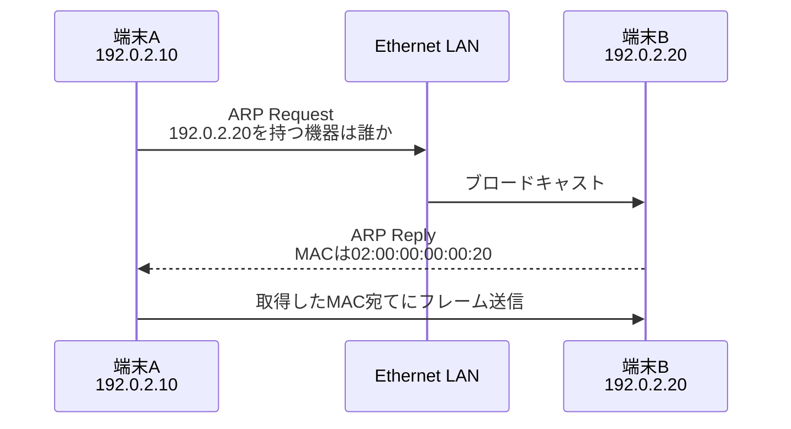

# 第04章 ARP

**― IPv4アドレスから同じリンク内のMACアドレスを調べる ―**

> この章では、IPv4通信でIPアドレスとMACアドレスを結び付けるARPの流れと、Linuxで近隣情報を確認する方法を学びます。

------------------------------------------------------------------------

# 1. この章で学べること

- ARPが必要な理由
- ARP RequestとARP Reply
- ARPキャッシュ・近隣テーブル
- 同一ネットワーク宛てと別ネットワーク宛ての違い
- LinuxでARPの状態と通信を確認する方法

# 2. この章の位置付け

第1章・第2章でIPネットワークの範囲、第3章でEthernetのMACアドレスを学びました。本章では、IPv4アドレスから実際のフレーム送信に必要なMACアドレスを得る方法をつなぎます。

# 3. なぜARPが必要になったのか

アプリケーションは宛先をIPアドレスで指定しますが、Ethernetフレームを同じリンクへ送るには宛先MACアドレスが必要です。IPアドレスとMACアドレスは役割も割り当て方法も異なるため、固定の計算だけで変換できません。

そこでIPv4では、同じリンク上のIPアドレスに対応するMACアドレスを問い合わせる**ARP（Address Resolution Protocol）**を利用します。

# 4. 技術の概要

ARPは次の流れで動作します。

1. 送信元が「このIPv4アドレスを持つ機器は誰か」とARP Requestを送ります。
2. 対象機器が自分のMACアドレスをARP Replyで返します。
3. 送信元は対応関係を一時的にARPキャッシュへ保存します。
4. 取得したMACアドレスを宛先としてEthernetフレームを送ります。

ARP Requestは相手のMACアドレスが不明なためブロードキャストされ、ARP Replyは通常ユニキャストで返されます。

# 5. 詳しい仕組み



## 同一ネットワーク宛て

宛先が同一ネットワークなら、送信元は宛先端末自身のMACアドレスをARPで調べます。

## 異なるネットワーク宛て

宛先が別ネットワークなら、送信元は最終宛先ではなく、デフォルトゲートウェイのMACアドレスをARPで調べます。

```text
最終IP宛先       198.51.100.20
最初のMAC宛先    デフォルトゲートウェイのMACアドレス
```

ARPはルータを越えて遠隔ネットワークへ問い合わせる仕組みではありません。

## ARPキャッシュ

問い合わせのたびにブロードキャストすると負荷が増えるため、OSはIPアドレスとMACアドレスの対応を一定時間保存します。LinuxではIPv4のARP情報もIPv6の近隣情報も、近隣テーブルとして `ip neigh` で確認できます。

代表的な状態には次があります。

- `REACHABLE`：最近到達可能であることを確認済み
- `STALE`：情報はあるが、最近は到達確認していない
- `DELAY` / `PROBE`：到達性を再確認中
- `FAILED`：解決または到達確認に失敗

## IPv6との違い

IPv6はARPを使いません。ICMPv6を利用する**近隣探索（Neighbor Discovery）**で同様の役割を実現します。

# 6. Linuxではどうなるか

```bash
# 近隣テーブルを表示
ip neigh show

# 宛先へ通信してから対応を確認
ping -c 1 192.0.2.20
ip neigh show 192.0.2.20

# ARPパケットを取得
sudo tcpdump -i eth0 -nn -e arp
```

代表的な出力例（必要な部分のみ抜粋）

```text
$ ip neigh show
192.0.2.1 dev eth0 lladdr 02:00:00:00:00:01 REACHABLE
192.0.2.20 dev eth0 lladdr 02:00:00:00:00:20 STALE

$ sudo tcpdump -i eth0 -nn -e arp
02:00:00:00:00:10 > ff:ff:ff:ff:ff:ff, Request who-has 192.0.2.20 tell 192.0.2.10
02:00:00:00:00:20 > 02:00:00:00:00:10, Reply 192.0.2.20 is-at 02:00:00:00:00:20
```

確認ポイント

- `lladdr` の後ろが、対象IPv4アドレスに対応するMACアドレスです。
- `dev` はその近隣が存在するインターフェースです。
- Requestの宛先 `ff:ff:ff:ff:ff:ff` はEthernetブロードキャストです。
- `who-has` が問い合わせ、`is-at` がMACアドレスを知らせる応答です。
- tcpdumpにはネットワーク情報が含まれるため、取得権限と共有範囲に注意します。

# 7. 実務ではどう使われるか

## 実務コラム：近隣テーブルがFAILEDになる

同じサブネットの相手へ届かず、`ip neigh` が `INCOMPLETE` や `FAILED` になる場合、ARP Replyを受信できていません。

```bash
ip route get 192.0.2.20
ip neigh show 192.0.2.20
sudo tcpdump -i eth0 -nn arp
```

代表的な出力例（必要な部分のみ抜粋）

```text
$ ip route get 192.0.2.20
192.0.2.20 dev eth0 src 192.0.2.10

$ ip neigh show 192.0.2.20
192.0.2.20 dev eth0 FAILED
```

確認ポイント

- `dev eth0` で直接接続と判断しているため、LinuxはARPによる解決を試みます。
- `FAILED` なら、相手の電源・リンク、VLAN、サブネット設定、重複IP、途中のフィルタを確認します。
- Requestだけ見えてReplyがなければ、相手側へ届いていないか、相手が応答できていない可能性があります。

# 8. FE/APではどう問われるか

ARPの目的、RequestがブロードキャストでReplyが通常ユニキャストであること、別ネットワーク宛てではデフォルトゲートウェイのMACアドレスを調べることが問われます。IPv6ではARPではなく近隣探索を使う点も整理します。

# 9. まとめ

- ARPはIPv4アドレスに対応する同一リンク内のMACアドレスを調べます。
- Requestはブロードキャスト、Replyは通常ユニキャストです。
- 別ネットワーク宛てでは、デフォルトゲートウェイのMACアドレスを解決します。
- Linuxでは `ip neigh` で対応と状態を確認できます。

# 10. 理解度チェック

1. ARPは何から何を調べるプロトコルですか。
2. ARP Requestがブロードキャストされるのはなぜですか。
3. 遠隔サーバ宛て通信では、どの機器のMACアドレスをARPで調べますか。
4. IPv6でARPに相当する役割は何が担いますか。

# 11. 解答・解説

## 問1

同じリンク内のIPv4アドレスに対応するMACアドレスを調べます。

## 問2

問い合わせ時点では対象のMACアドレスが分からず、特定のユニキャスト宛先を指定できないためです。

## 問3

同じLAN上にあるデフォルトゲートウェイのMACアドレスです。遠隔サーバへ直接ARP Requestを送るわけではありません。

## 問4

ICMPv6を利用する近隣探索が担います。

# 12. 実務で考えてみよう

## ケース：IPアドレス変更後も古い機器へ通信が届く

### 解答例

端末やルータの近隣テーブルに古いIP・MAC対応が残っている可能性があります。`ip neigh` で現在の対応と状態を確認します。必要な場合だけ影響範囲を理解してキャッシュ更新を促します。安易な全削除より、重複IPや誤設定がないかを先に確認します。

# 13. 次章へのつながり

次章では、宛先が別ネットワークの場合にルータがどの経路を選び、パケットを次へ渡すかを学びます。

------------------------------------------------------------------------

# レビュー状況（執筆メモ）

- 執筆：完了
- レビュー①（章レビュー）：未実施
- レビュー②（部レビュー）：第2部完成後に実施予定
