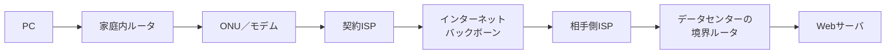

# 第05章 ルーティング

**― 宛先ネットワークへ向かう次の道を選ぶ ―**

> この章では、同一ネットワークと異なるネットワークへの通信の違い、ルーティングテーブル、デフォルトゲートウェイによる経路選択を学びます。

------------------------------------------------------------------------

# 1. この章で学べること

- ルーティングが必要な理由
- 同一ネットワーク通信と異なるネットワーク通信
- ルーティングテーブルの読み方
- デフォルトルートとデフォルトゲートウェイ
- Linuxで実際に選択される経路を確認する方法

# 2. この章の位置付け

第4章までに、同じリンク内で相手のMACアドレスを調べてフレームを送る仕組みを学びました。本章では、宛先が別ネットワークにあるとき、ルータを経由してパケットを届ける仕組みを扱います。

# 3. なぜルーティングが必要になったのか

世界中の機器を一つのLANへ接続すると、ブロードキャストの範囲が巨大になり、障害や管理の影響も全体へ広がります。そこでネットワークを分割し、必要な通信だけをネットワーク間で転送します。

宛先IPアドレスに応じて次の転送先を決める処理を**ルーティング（Routing）**と呼びます。ルータだけでなく、PCやサーバも最初の送信先を決めるためにルーティングを行います。

# 4. 技術の概要

送信元は、自分のIPアドレスとプレフィックス長を使って、宛先が同一ネットワークか判断します。

- 同一ネットワーク：宛先端末へ直接フレームを送る
- 異なるネットワーク：ルータへフレームを送る

経路の候補は**ルーティングテーブル（Routing Table）**に記録されます。各項目には宛先ネットワーク、次の転送先、出力インターフェースなどがあります。

# 5. 詳しい仕組み

## 同一ネットワーク通信

端末A `192.0.2.10/24` から端末B `192.0.2.20/24` へ送る場合、双方は `192.0.2.0/24` に属します。端末AはARPで端末BのMACアドレスを調べ、直接フレームを送ります。

## 異なるネットワーク通信

端末Aから `198.51.100.20` へ送る場合、宛先は別ネットワークです。端末AはデフォルトゲートウェイのMACアドレスをARPで調べ、IPパケットをルータへ渡します。

家庭からインターネット上のサーバへ向かう代表例では、**ONU（Optical Network Unit: 光回線終端装置）**やモデムを介して、契約先の**ISP（Internet Service Provider: インターネットサービスプロバイダ）**へ接続します。



これは代表的な概念図であり、実際の経路や装置数は回線・地域・サービスによって異なります。ONUは光信号と宅内側の通信を接続し、ルーティングを家庭内ルータや通信事業者側装置が担当する構成が一般的です。

世界中のルータは、パケットの最終宛先IPアドレスと自分のルーティングテーブルを見て、次に渡す相手を判断しながらリレーします。一台のルータがPCからWebサーバまでの全経路を指示するのではありません。各ルータが「次の一歩」を選び、その判断が連続することで遠隔ネットワークへ届きます。

## デフォルトルート

個別の経路に一致しない宛先をまとめて扱う経路を**デフォルトルート（Default Route）**と呼びます。IPv4では `0.0.0.0/0`、IPv6では `::/0` と表します。

端末がデフォルトルートで使用する次のルータが**デフォルトゲートウェイ（Default Gateway）**です。

## 最長一致

複数の経路が宛先に一致する場合、より長いプレフィックス、つまりより具体的な経路が優先されます。これを**最長プレフィックス一致（Longest Prefix Match）**と呼びます。

```text
192.0.2.0/24  via 203.0.113.1
192.0.2.128/25 via 203.0.113.2

宛先 192.0.2.150 → より具体的な /25 を選択
```

同じプレフィックス長の候補が複数ある場合は、経路の優先度やコストなど、追加の基準が使われます。

## 静的ルーティングと動的ルーティング

- **静的ルーティング（Static Routing）**：管理者が経路を設定する
- **動的ルーティング（Dynamic Routing）**：ルータ同士がプロトコルで経路情報を交換する

第2部では経路選択の土台を扱い、OSPFやBGPなど個別の動的ルーティングプロトコルは後続章で扱います。

# 6. Linuxではどうなるか

```bash
# ルーティングテーブルを表示
ip route show

# 指定宛先へ実際に選ばれる経路を表示
ip route get 198.51.100.20

# IPv6のルーティングテーブルを表示
ip -6 route show

# 経路上のホップを推測
traceroute -n 198.51.100.20
```

代表的な出力例（必要な部分のみ抜粋）

```text
$ ip route show
default via 192.0.2.1 dev eth0
192.0.2.0/24 dev eth0 proto kernel scope link src 192.0.2.10
198.51.100.0/24 via 192.0.2.254 dev eth0

$ ip route get 198.51.100.20
198.51.100.20 via 192.0.2.254 dev eth0 src 192.0.2.10

$ ip -6 route show
2001:db8:1::/64 dev eth0 proto kernel
default via 2001:db8:1::1 dev eth0

$ traceroute -n 198.51.100.20
 1  192.0.2.1      0.6 ms
 2  203.0.113.1    4.2 ms
 ...
 8  198.51.100.20  8.4 ms
```

確認ポイント

- `default via` の後ろがデフォルトゲートウェイです。
- 宛先ネットワークの後ろに `via` がなければ、同じリンク上へ直接送る経路です。
- `dev` が出力インターフェース、`src` が選択された送信元IPアドレスです。
- `ip route get` は候補一覧ではなく、指定宛先に対する実際の選択結果を示します。
- tracerouteの各行は経路上のホップです。ただし、応答しないルータ、負荷分散、往路と復路の違いにより、実際の物理経路を完全に表すとは限りません。

Windowsでは、同じ目的の確認に `tracert` コマンドを使用できます。tracerouteの詳しい仕組みは第6章で扱います。

# 7. 実務ではどう使われるか

## 実務コラム：特定ネットワークだけ到達できない

インターネットの多くへ到達できるのに特定拠点だけ届かない場合、デフォルトルートより具体的な誤経路が優先されていることがあります。VPN接続が追加した経路も確認します。

```bash
ip route get 10.20.30.40
ip route show
```

代表的な出力例（必要な部分のみ抜粋）

```text
$ ip route get 10.20.30.40
10.20.30.40 via 192.0.2.253 dev eth0 src 192.0.2.10

$ ip route show
10.20.30.0/24 via 192.0.2.253 dev eth0 metric 50
10.0.0.0/8 via 192.0.2.254 dev eth0 metric 100
```

確認ポイント

- `10.20.30.40` には `/8` より具体的な `/24` が選ばれます。
- `metric` が小さくても、まずプレフィックス長の長い経路が優先されます。
- 設定を削除する前に、VPNや管理ツールが意図して追加した経路でないか確認します。

# 8. FE/APではどう問われるか

同一・異なるネットワークの判断、デフォルトゲートウェイ、ルーティングテーブル、最長一致、静的・動的ルーティングの違いが問われます。経路表から指定宛先に使う経路を選べるようにします。

# 9. まとめ

- ルーティングは、宛先IPアドレスに応じて次の転送先を選ぶ処理です。
- 同一ネットワークへは直接、異なるネットワークへはルータを経由して送ります。
- 個別経路に一致しない宛先にはデフォルトルートを使います。
- 複数経路が一致する場合は、より具体的なプレフィックスが優先されます。

# 10. 理解度チェック

1. 同一ネットワーク宛てと異なるネットワーク宛てでは、最初にARPで調べる相手がどう違いますか。
2. IPv4のデフォルトルートをCIDRで表してください。
3. `10.0.0.0/8` と `10.20.0.0/16` があるとき、`10.20.30.40` にはどちらが選ばれますか。
4. 静的ルーティングと動的ルーティングの違いを説明してください。

# 11. 解答・解説

## 問1

同一ネットワークなら最終宛先端末、異なるネットワークなら次に渡すデフォルトゲートウェイのMACアドレスを調べます。

## 問2

`0.0.0.0/0` です。

## 問3

より具体的な `10.20.0.0/16` が選ばれます。

## 問4

静的ルーティングは管理者が経路を設定します。動的ルーティングはルータ同士がプロトコルで経路情報を交換し、変化へ対応します。

# 12. 実務で考えてみよう

## ケース：デフォルトゲートウェイを二つ設定した

### 解答例

同じプレフィックス長のデフォルトルートが複数あると、メトリックやポリシーにより経路が選ばれます。意図しない回線から送信され、戻り経路と非対称になる場合があります。`ip route` と `ip route get` で実際の選択を確認し、冗長化要件に沿って設定します。

# 13. 次章へのつながり

次章では、IP通信の到達状況や経路上の問題を通知するICMPと、`ping`・`traceroute` の仕組みを学びます。

------------------------------------------------------------------------

# レビュー状況（執筆メモ）

- 執筆：完了
- レビュー①（章レビュー）：未実施
- レビュー②（部レビュー）：第2部完成後に実施予定
