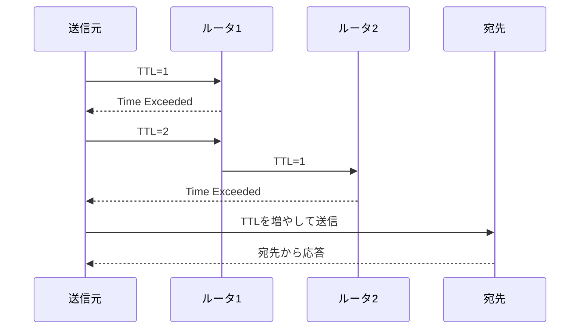

# 第06章 ICMP

**― IP通信の状態や異常を知らせる制御メッセージ ―**

> この章では、ICMPの役割と、ping・tracerouteが到達確認や経路調査を行う仕組みを学びます。

------------------------------------------------------------------------

# 1. この章で学べること

- ICMPが必要な理由
- Echo RequestとEcho Reply
- 到達不能などのエラーメッセージ
- TTLとtracerouteの関係
- Linuxで疎通と経路を確認する方法

# 2. この章の位置付け

第5章では、ルータが経路を選んでIPパケットを転送することを学びました。本章では、転送中の問題や到達状況を送信元へ知らせる制御プロトコルを扱います。

# 3. なぜICMPが必要になったのか

IPはパケットの配送を試みますが、到着を保証しません。宛先へ経路がない、TTLが0になった、パケットが大きすぎるなどの問題が起きたとき、何も通知されなければ原因を判断しにくくなります。

そこでIP通信の状態やエラーを通知する**ICMP（Internet Control Message Protocol）**が使われます。ICMPはアプリケーションデータを運ぶ主役ではなく、IPを補助する制御プロトコルです。

# 4. 技術の概要

ICMPメッセージには種類を表すTypeと、より詳しい理由を表すCodeがあります。

代表例は次のとおりです。

| 用途 | ICMPv4の例 |
|---|---|
| 到達確認 | Echo Request / Echo Reply |
| 宛先へ到達不能 | Destination Unreachable |
| TTL超過 | Time Exceeded |
| 経路変更の通知 | Redirect |

IPv6ではICMPv6が使われ、エラー通知だけでなく近隣探索など重要な役割も担います。

# 5. 詳しい仕組み

## ping

**ping**は、ICMP Echo Requestを送り、相手からEcho Replyが返るかを確認するコマンドです。応答から往復時間やパケット損失の目安も得られます。

ただし、pingが成功しても対象アプリケーションが動いているとは限りません。逆に、FirewallがICMP Echoを遮断していれば、WebやSSHが利用できてもpingは失敗します。

## TTL

**TTL（Time To Live）**はIPv4ヘッダにある値で、ルータを一つ通過するたびに1減ります。0になるとルータはパケットを破棄し、通常はICMP Time Exceededを送信元へ返します。

IPv6では同じ目的の値をHop Limitと呼びます。

## traceroute

**traceroute**はTTLを1、2、3と変えながらパケットを送り、各ルータから返るTime Exceededを利用して経路を推測します。



途中の機器が応答しない、応答経路が異なる、負荷分散がある場合は、すべてのホップが正確に表示されるとは限りません。

## 到達不能メッセージ

Destination Unreachableは、ネットワークやホストへの経路がない、ポートへ到達できない、分割が必要だが禁止されている、などを知らせます。Firewall設定によっては通知せず破棄されることもあります。

# 6. Linuxではどうなるか

```bash
# IPv4の到達確認
ping -c 4 192.0.2.1

# IPv6の到達確認
ping -6 -c 4 2001:db8:1::1

# 経路を名前解決せずに確認
traceroute -n 198.51.100.20
```

代表的な出力例（必要な部分のみ抜粋）

```text
$ ping -c 4 192.0.2.1
64 bytes from 192.0.2.1: icmp_seq=1 ttl=64 time=0.54 ms
...
4 packets transmitted, 4 received, 0% packet loss
rtt min/avg/max/mdev = 0.48/0.52/0.56/0.03 ms

$ traceroute -n 198.51.100.20
 1  192.0.2.1      0.612 ms  0.581 ms  0.570 ms
 2  203.0.113.1    4.201 ms  4.188 ms  4.176 ms
 3  198.51.100.20  8.442 ms  8.419 ms  8.401 ms
```

確認ポイント

- `icmp_seq` は要求と応答を対応付ける連番です。
- `ttl` は受信した応答パケットに残っていたTTLで、往路の正確なホップ数そのものではありません。
- `time` は往復時間の目安、`packet loss` は応答が返らなかった割合です。
- tracerouteの各行が推測されたホップです。`*` は、その試行で時間内に応答を得られなかったことを示します。

`traceroute` は標準で導入されていない環境があります。また実装によりUDP、ICMP、TCPのどれを探査に使うかが異なります。

# 7. 実務ではどう使われるか

## 実務コラム：pingの結果だけで正常・異常を決めない

pingが成功するのにWeb接続が失敗する場合、IP到達性はあるものの、TCPポート、TLS、アプリケーションなどに問題がある可能性があります。pingが失敗しても、ICMPだけが制限されている場合があります。

```bash
ping -c 2 198.51.100.20
traceroute -n 198.51.100.20
curl -I --connect-timeout 5 http://198.51.100.20/
```

代表的な出力例（必要な部分のみ抜粋）

```text
$ ping -c 2 198.51.100.20
2 packets transmitted, 0 received, 100% packet loss

$ curl -I --connect-timeout 5 http://198.51.100.20/
HTTP/1.1 200 OK
```

確認ポイント

- ICMP Echoへの応答がなくてもHTTP応答が返るなら、宛先までの通信全体が停止しているわけではありません。
- プロトコルごとに許可・遮断が異なるため、目的のサービス自体も確認します。
- この例はICMPとHTTPの許可状態が異なる場合を説明するもので、実際の調査では対象サービスのホスト名とプロトコルを使用します。

# 8. FE/APではどう問われるか

ICMPの役割、pingのEcho Request/Reply、TTLによるループ防止、tracerouteの仕組み、Destination Unreachableが問われます。「ping失敗＝相手停止」とは限らない点も理解します。

# 9. まとめ

- ICMPはIP通信の状態やエラーを通知します。
- pingはEcho RequestとEcho Replyで到達性を確認します。
- TTLはルータ通過ごとに減り、パケットが永久に循環することを防ぎます。
- tracerouteはTTL超過の応答を利用して経路を推測します。

# 10. 理解度チェック

1. ICMPはIP通信に対してどのような役割を持ちますか。
2. pingが成功してもWebサービスの正常性を保証できないのはなぜですか。
3. TTLが0になったパケットを受けたルータは通常どうしますか。
4. tracerouteが経路を推測できる仕組みを説明してください。

# 11. 解答・解説

## 問1

到達状況や経路上のエラーを制御メッセージとして通知し、IPを補助します。

## 問2

pingはICMPへの応答を確認するだけで、TCP接続やWebアプリケーションの応答までは確認しないためです。

## 問3

パケットを破棄し、通常は送信元へICMP Time Exceededを返します。

## 問4

TTLを1から順に増やして探査し、各ルータがTTL超過時に返すICMP Time Exceededの送信元を並べます。

# 12. 実務で考えてみよう

## ケース：tracerouteの途中が `*` だが宛先には到達する

### 解答例

途中のルータがTTL超過メッセージを返さない、応答を低優先度で処理する、Firewallが遮断する、といった可能性があります。後続ホップや宛先から応答があるなら、その `*` だけで転送障害とは判断しません。目的の通信結果と合わせて評価します。

# 13. 次章へのつながり

次章では、端末へIPアドレス、プレフィックス長、デフォルトゲートウェイなどを自動配布するDHCPを学びます。

------------------------------------------------------------------------

# レビュー状況（執筆メモ）

- 執筆：完了
- レビュー①（章レビュー）：未実施
- レビュー②（部レビュー）：第2部完成後に実施予定
