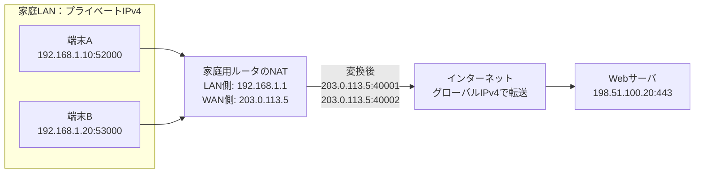

# 第08章 NAT

**― IPアドレスを書き換えて異なるアドレス空間をつなぐ ―**

> この章では、IPv4アドレス不足を背景に広く使われるNATと、家庭用ルータで多数の端末が一つのグローバルIPv4アドレスを共有する仕組みを学びます。

------------------------------------------------------------------------

# 1. この章で学べること

- NATが必要になった背景
- 送信元NATと宛先NAT
- NAPT・ポート変換の概要
- 家庭用ルータでの利用
- LinuxでNATルールと変換状態を確認する方法

# 2. この章の位置付け

第1章でプライベートIPアドレス、第5章でルーティングを学びました。本章では、異なるアドレス空間の境界でIPアドレスやポート番号を書き換える仕組みを扱い、第2部をまとめます。

# 3. なぜNATが必要になったのか

IPv4は約43億個のアドレスしかなく、インターネットの普及に伴って、インターネット上で一意に使う**グローバルIPv4アドレス**が不足しました。プライベートIPv4アドレスは家庭や組織ごとに再利用できますが、そのままインターネットの経路制御には使えません。

不足しているのは「端末内部で使える番号全般」ではなく、各端末へ一意に割り当てられるグローバルIPv4アドレスです。すべての家庭内端末や社内端末へ一つずつ割り当てることは困難です。

そこで、内部では再利用可能なプライベートIPアドレスを使い、外部通信時にグローバルIPv4アドレスへ変換する**NAT（Network Address Translation）**が広く使われるようになりました。

# 4. 技術の概要

NATは、ルータやFirewallなどが通過するパケットのIPアドレスを書き換え、戻りの通信を元の端末へ対応付ける仕組みです。

代表的な種類は次のとおりです。

- **送信元NAT（Source NAT: SNAT）**：送信元IPアドレスを書き換える
- **宛先NAT（Destination NAT: DNAT）**：宛先IPアドレスを書き換える
- **NAPT（Network Address Port Translation）**：IPアドレスに加えてポート番号も変換する

家庭用ルータで複数端末が一つのグローバルIPv4アドレスを共有する処理は、厳密にはNAPTに相当することが一般的です。日常的にはこれもまとめてNATと呼ばれます。

# 5. 詳しい仕組み

## 送信時の変換

内部端末 `192.168.1.10:52000` がWebサーバ `198.51.100.20:443` へ接続するとします。ルータは送信元を自分のグローバルIPv4アドレスと空いているポートへ変換します。

```text
変換前  192.168.1.10:52000 → 198.51.100.20:443
変換後  203.0.113.5:40001  → 198.51.100.20:443
```

ルータは変換対応を状態として記録します。応答が `203.0.113.5:40001` へ戻ると、宛先を `192.168.1.10:52000` へ戻して内部へ転送します。



家庭LAN内では `192.168.x.x` などのプライベートIPv4アドレスを使い、NATルータの境界でグローバルIPv4アドレスへ変換してインターネットへ送ります。ポート番号も使うことで、同じグローバルIPv4アドレスを複数の内部通信で共有できます。

## 宛先NAT・ポート転送

外部からルータの特定ポートへ届いた通信を、内部サーバへ転送する設定は**ポートフォワーディング（Port Forwarding）**と呼ばれます。

```text
203.0.113.5:8443 → 192.168.1.50:443
```

公開するポートは攻撃対象になります。必要性、アクセス制御、サーバの更新、ログ監視を合わせて設計します。

## NATとFirewallの違い

NATはアドレスやポートを変換する仕組み、Firewallは条件に基づいて通信を許可・遮断する仕組みです。家庭用ルータでは同じ装置が両方を行うため混同されやすいですが、役割は異なります。

「NATがあるから安全」とは言い切れません。意図しない転送設定、内部から開始した通信、脆弱なルータ設定など、別のリスクがあります。

## NATの制約

NATはパケットのアドレスを書き換えるため、端末同士が直接通信するというインターネット本来のモデルを複雑にします。

- 外部から内部へ新規接続しにくい
- 一部のプロトコルはIPアドレスをデータ内にも含める
- 障害調査で変換前後の対応が必要
- 多段NATではポート転送や経路設計が複雑になる

IPv6では広大なアドレス空間があり、IPv4アドレス節約だけを目的とするNATは基本的に不要です。ただし、IPv6でもFirewallによるアクセス制御は必要です。

# 6. Linuxではどうなるか

LinuxではnftablesなどでNATを設定できます。次は既存設定を変更せず確認する例です。

```bash
# nftablesのNATルールを確認
sudo nft list ruleset

# conntrackツールがあれば変換状態を確認
sudo conntrack -L -p tcp

# Linux自身の外向きアドレスと経路を確認
ip route get 198.51.100.20
```

代表的な出力例（必要な部分のみ抜粋）

```text
$ sudo nft list ruleset
table ip nat {
    chain postrouting {
        type nat hook postrouting priority srcnat;
        oifname "eth0" masquerade
    }
    chain prerouting {
        type nat hook prerouting priority dstnat;
        tcp dport 8443 dnat to 192.168.1.50:443
    }
}

$ sudo conntrack -L -p tcp
tcp ... src=192.168.1.10 dst=198.51.100.20 sport=52000 dport=443 ...
        src=198.51.100.20 dst=203.0.113.5 sport=443 dport=40001 ...

$ ip route get 198.51.100.20
198.51.100.20 via 203.0.113.1 dev eth0 src 203.0.113.5
```

確認ポイント

- `postrouting` と `masquerade` は、外向き送信時の送信元変換に使われます。
- `dnat to 192.168.1.50:443` は、8443番宛てを内部サーバの443番へ変換する例です。
- conntrack出力では、変換前後の送信元・宛先IPアドレスとポート番号を対応付けます。
- `conntrack` は標準で導入されていない場合があり、表示には管理権限が必要です。

# 7. 実務ではどう使われるか

## 実務コラム：ポートフォワーディング先へ接続できない

外部から内部サーバへ接続できない場合、NATルールだけでなく、外側Firewall、ルータの待受回線、内部経路、サーバの待受アドレス、サーバ側Firewallを確認します。

```bash
sudo nft list ruleset
ss -lntp
ip route get 192.168.1.50
```

代表的な出力例（必要な部分のみ抜粋）

```text
$ ss -lntp
State  Local Address:Port  Process
LISTEN 127.0.0.1:443       users:(("web",pid=2100,fd=5))

$ ip route get 192.168.1.50
192.168.1.50 dev eth1 src 192.168.1.1
```

確認ポイント

- 内部サーバが `127.0.0.1:443` だけで待ち受けている場合、ルータから転送された通信を受け取れません。
- NATルータから内部サーバへの経路と、内部サーバから戻る経路の両方を確認します。
- 変換ルールが存在しても、Firewallが通信を許可しているとは限りません。

# 8. FE/APではどう問われるか

NATの目的、プライベートIPアドレスとグローバルIPアドレスの変換、NAPTでポート番号を使って複数通信を識別する仕組み、ポートフォワーディングが問われます。NATとFirewallの役割の違いも重要です。

# 9. まとめ

- NATはパケットのIPアドレスを変換します。
- NAPTはポート番号も利用し、複数端末で一つのグローバルIPv4アドレスを共有します。
- ポートフォワーディングは外部宛て通信を内部サーバへ変換・転送します。
- NATとFirewallは同じ装置で動くことがありますが、役割は異なります。

# 10. 理解度チェック

1. NATが広く普及した背景を説明してください。
2. SNATとDNATでは何を書き換えますか。
3. NAPTは複数の内部通信をどのように区別しますか。
4. NATとFirewallの違いを説明してください。

# 11. 解答・解説

## 問1

IPv4アドレスが不足し、プライベートIPアドレスを使う多数の端末で限られたグローバルIPv4アドレスを共有する必要が高まったためです。

## 問2

SNATは送信元IPアドレス、DNATは宛先IPアドレスを書き換えます。NAPTではポート番号も変換します。

## 問3

変換後のポート番号と通信状態を対応表へ記録し、戻りの通信を元の内部IPアドレスとポートへ戻します。

## 問4

NATはアドレスやポートを変換し、Firewallは条件に基づいて通信を許可または遮断します。

# 12. 実務で考えてみよう

## ケース：社内からは公開サービスへ接続できるが、インターネットからは接続できない

### 解答例

社内から内部アドレスへ直接接続しているだけなら、外部向けDNATの動作は確認できていません。外部回線側のアドレス、DNATとFirewall、内部サーバの待受、戻り経路を確認します。内部から外部アドレスへ接続する場合は、ヘアピンNAT対応の有無も確認します。

# 13. 次章へのつながり

第2部では、IPアドレス、サブネット、Ethernet、ARP、ルーティング、ICMP、DHCP、NATという通信の土台を学びました。第3部では、この土台の上でアプリケーション間の通信を担うTCP・UDPや各種サービスへ進みます。

------------------------------------------------------------------------

# レビュー状況（執筆メモ）

- 執筆：完了
- レビュー①（章レビュー）：未実施
- レビュー②（部レビュー）：第2部完成後に実施予定
