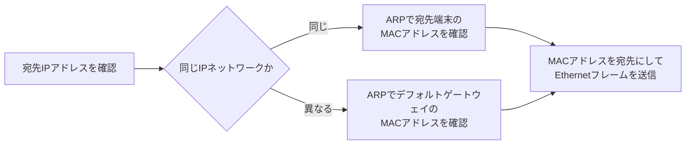
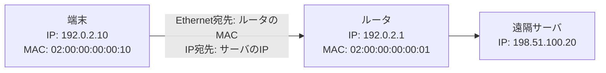

# 第03章 MACアドレス

**― 同じリンク内でフレームを届ける識別子 ―**

> この章では、Ethernetで使われるMACアドレスの役割と、IPアドレスとの違いを学びます。

------------------------------------------------------------------------

# 1. この章で学べること

- MACアドレスが必要な理由
- MACアドレスの表記と構造
- IPアドレスとの役割の違い
- NIC・Ethernet・スイッチとの関係
- LinuxでMACアドレスを確認する方法

# 2. この章の位置付け

IPアドレスはネットワーク間の届け先を表します。しかし、Ethernet上で隣の機器へ実際にフレームを渡すには、データリンク層の識別子が必要です。本章ではその役割を持つMACアドレスを扱います。

# 3. なぜMACアドレスが必要になったのか

同じEthernet LANには複数のNICが接続されます。電気信号や光信号としてフレームが届いても、どのNICが受け取るべきかを区別できなければ通信できません。

そこでEthernetでは、同じリンク内の送信元と宛先を表す**MACアドレス（Media Access Control Address）**をフレームへ記録します。スイッチもMACアドレスを見て転送先ポートを選びます。

## IPアドレスがあるのに、なぜMACアドレスも必要なのか

IPアドレスは、ネットワークを越えて最終的な届け先を示す「住所」です。一方、Ethernetは一回のリンクでフレームを渡す仕組みであり、そのリンク内で実際に受け取るNICをMACアドレスで指定します。

道路を使った配送に例えると、IPアドレスは最終目的地の住所、MACアドレスは現在いる配送拠点から次の配送拠点へ荷物を渡すための宛先に相当します。ルータを越えるたびに次のリンクで使うMACアドレスは変わりますが、IPアドレスは最終宛先を示し続けます。

IPだけ、またはMACだけで代用するのではなく、異なる範囲を担当する二つの仕組みを組み合わせることで、Ethernet以外のリンクも含むネットワーク間通信を実現できます。

# 4. 技術の概要

Ethernetで一般的なMACアドレスは48ビットで、16進数2桁ずつを区切って表します。

```text
02:42:ac:11:00:02
```

MACアドレスはNICに割り当てられますが、「永久に変更できない製造番号」と考えるのは正確ではありません。OSや仮想化環境で変更でき、無線LANではプライバシー保護のためランダム化されることもあります。

# 5. 詳しい仕組み

## MACアドレスの構造

48ビットのMACアドレスでは、先頭側にベンダを識別するための範囲が使われる場合があります。ただし、ローカルで管理するアドレスや仮想NICでは、組織が独自に値を設定できます。

先頭オクテットの下位ビットには、個別宛てかグループ宛てか、グローバル管理かローカル管理かを示す意味があります。

## ユニキャスト・ブロードキャスト・マルチキャスト

- **ユニキャスト（Unicast）**：特定の一つのNIC宛て
- **ブロードキャスト（Broadcast）**：同じLAN内のすべてのNIC宛て
- **マルチキャスト（Multicast）**：特定のグループ宛て

EthernetのブロードキャストMACアドレスは `ff:ff:ff:ff:ff:ff` です。

## IPアドレスとの違い

| 項目 | IPアドレス | MACアドレス |
|---|---|---|
| 主な層 | ネットワーク層 | データリンク層 |
| 主な範囲 | ネットワークを越えた配送 | 同じリンク内の配送 |
| 参照する機器 | ルータなど | NIC、スイッチなど |
| 変更 | ネットワーク構成に応じて設定 | NICに割当、変更可能な場合あり |

## IPからEthernetフレームを送るまで

アプリケーションがIPアドレスを宛先にしても、Ethernet上ではMACアドレスが必要です。IPv4では次章で扱うARPを使い、送るべき相手のMACアドレスを調べます。



この流れは、**IPで最終宛先を決める → ARPで次に渡すMACアドレスを調べる → Ethernetでフレームを送る**と整理できます。

遠隔サーバへ送る場合でも、Ethernetフレームの宛先MACアドレスは通常、遠隔サーバではなく、同じLANにいるデフォルトゲートウェイのMACアドレスです。ルータを通るたびにリンク層のヘッダは作り直されますが、IPの最終宛先は基本的に維持されます。



## スイッチのMACアドレス学習

スイッチは受信フレームの送信元MACアドレスと受信ポートを学習します。宛先MACアドレスを学習済みなら対応ポートへ転送し、未学習なら受信ポート以外へフラッディングします。

# 6. Linuxではどうなるか

```bash
# インターフェースとMACアドレスを簡潔に表示
ip -br link

# 特定インターフェースの詳細を表示
ip link show dev eth0

# NIC情報を表示
ethtool -i eth0
```

代表的な出力例（必要な部分のみ抜粋）

```text
$ ip -br link
lo      UNKNOWN  00:00:00:00:00:00 <LOOPBACK,UP,LOWER_UP>
eth0    UP       02:42:ac:11:00:02 <BROADCAST,MULTICAST,UP,LOWER_UP>

$ ip link show dev eth0
2: eth0: <BROADCAST,MULTICAST,UP,LOWER_UP> ...
    link/ether 02:42:ac:11:00:02 brd ff:ff:ff:ff:ff:ff

$ ethtool -i eth0
driver: example_nic
bus-info: 0000:02:00.0
```

確認ポイント

- `link/ether` の後ろがEthernetのMACアドレスです。
- `brd ff:ff:ff:ff:ff:ff` はEthernetのブロードキャストアドレスです。
- `BROADCAST` と `MULTICAST` は、そのインターフェースが各通信方式をサポートすることを示します。
- `driver` はNICに使用中のカーネルドライバです。

# 7. 実務ではどう使われるか

## 実務コラム：MACアドレスが重複した

仮想マシンを複製したときにMACアドレスも複製されると、スイッチが同じMACアドレスを異なるポートで交互に学習し、通信が不安定になることがあります。これをMACアドレスのフラッピングとして検知するスイッチもあります。

Linuxでは対象端末のMACアドレスを確認し、仮想化基盤やスイッチの学習情報と照合します。

```bash
ip -br link
ip neigh
```

代表的な出力例（必要な部分のみ抜粋）

```text
$ ip neigh
192.0.2.20 dev eth0 lladdr 02:42:ac:11:00:20 REACHABLE
```

確認ポイント

- `lladdr` の後ろが、Linuxが対象IPアドレスに対応付けたMACアドレスです。
- 期待した機器のMACアドレスと一致するか、時間によって変化しないかを確認します。

# 8. FE/APではどう問われるか

MACアドレスのビット長、Ethernetフレームでの役割、スイッチの学習、IPアドレスとの違いが問われます。MACアドレスは通常、ルータを越えて最終宛先までそのまま使われるものではない点が重要です。

# 9. まとめ

- MACアドレスは、主に同じEthernetリンク内でNICを識別します。
- Ethernetの一般的なMACアドレスは48ビットです。
- スイッチは送信元MACアドレスとポートの対応を学習します。
- 遠隔宛て通信では、フレームの宛先はデフォルトゲートウェイのMACアドレスになります。

# 10. 理解度チェック

1. MACアドレスは主に何層で使われますか。
2. EthernetのブロードキャストMACアドレスを答えてください。
3. 遠隔サーバ宛ての最初のEthernetフレームには、通常どの機器のMACアドレスが宛先として入りますか。
4. MACアドレスを「変更不可能な製造番号」と言い切れない理由を説明してください。

# 11. 解答・解説

## 問1

データリンク層で使われます。同じリンク内でEthernetフレームを届けるための識別子です。

## 問2

`ff:ff:ff:ff:ff:ff` です。

## 問3

送信元と同じLANにいるデフォルトゲートウェイのMACアドレスです。IPヘッダの最終宛先は遠隔サーバのIPアドレスです。

## 問4

OSで変更できる場合があり、仮想NICではソフトウェアが割り当て、無線LANではランダム化されることもあるためです。

# 12. 実務で考えてみよう

## ケース：スイッチを交換した直後だけ通信が不安定

### 解答例

スイッチがMACアドレスとポートの対応をまだ学習していない間は、未知の宛先をフラッディングします。通常は通信に伴って学習されます。長く続く場合は、ループ、MAC重複、リンクの不安定、VLAN設定を確認します。

# 13. 次章へのつながり

次章では、IPアドレスから同じリンク内のMACアドレスを調べるARPの仕組みを学びます。

------------------------------------------------------------------------

# レビュー状況（執筆メモ）

- 執筆：完了
- レビュー①（章レビュー）：未実施
- レビュー②（部レビュー）：第2部完成後に実施予定
