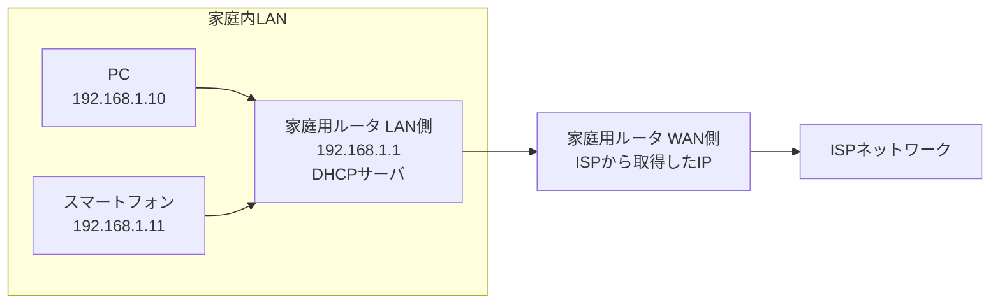
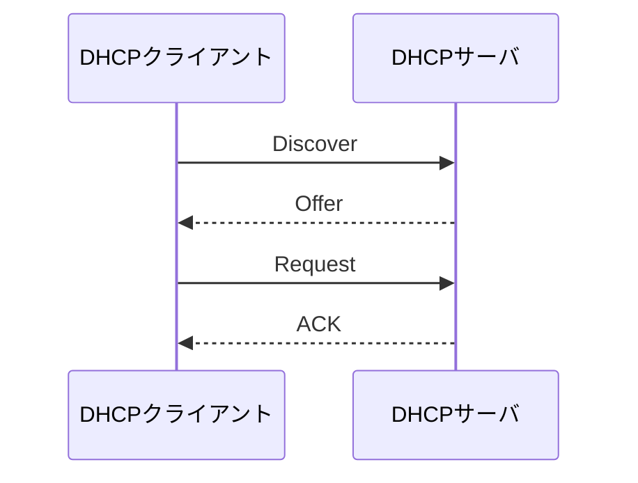

# 第07章 DHCP

**― 端末へネットワーク設定を自動配布する ―**

> この章では、IPアドレスなどを自動設定するDHCPと、Discover・Offer・Request・ACKの流れを学びます。

------------------------------------------------------------------------

# 1. この章で学べること

- DHCPが必要になった理由
- DHCPで配布できる主な設定
- Discover・Offer・Request・ACKの流れ
- リースとDHCPリレー
- Linuxで取得した設定とログを確認する方法

# 2. この章の位置付け

ここまで、端末が通信するにはIPアドレス、プレフィックス長、デフォルトゲートウェイなどが必要だと学びました。本章では、それらを端末へ自動的に配布する仕組みを扱います。

# 3. なぜDHCPが必要になったのか

端末が少なければ、一台ずつ手作業でIPアドレスを設定できます。しかし、数百台のPCや一時的に接続する端末を管理すると、入力ミス、重複IP、設定変更の手間が増えます。

そこで、主にLAN内の端末へネットワーク設定を自動配布する**DHCP（Dynamic Host Configuration Protocol）**が使われます。家庭、企業、学校など、端末の接続・切断や入れ替えがあるLANでは一般的な仕組みです。

# 4. 技術の概要

DHCPでは、代表的に次の情報を配布できます。

- IPアドレス
- サブネットマスク・プレフィックス長
- デフォルトゲートウェイ
- DNSサーバ
- リース期間
- ドメイン名などの追加情報

設定を要求する端末をDHCPクライアント、設定を提供する機器をDHCPサーバと呼びます。家庭用ルータがDHCPサーバを兼ねることも一般的です。

## DHCPはどこまで使われるのか

DHCPは、利用者端末が接続するLANで特に広く使われます。一方、インターネット全体のルータへDHCPで経路を配布する仕組みではありません。

- 家庭・企業・学校のLAN：PC、スマートフォン、プリンタなどへDHCPで設定することが一般的
- サーバ用LAN：DHCPの固定割り当て、または管理された静的設定を使う場合がある
- ISPから家庭用ルータのWAN側：接続方式に応じ、DHCPや**PPPoE（Point-to-Point Protocol over Ethernet）**などで設定を受け取る場合がある
- ISP・通信事業者の基幹ネットワーク：管理された固定設定や、組織内の経路交換に使われる**OSPF（Open Shortest Path First）**、組織間の経路交換に使われる**BGP（Border Gateway Protocol）**などを用途に応じて使う

DHCPは端末のアドレス設定を自動化し、OSPFやBGPはルータ間で経路情報を交換します。目的が異なるため、置き換え関係ではありません。



同じ家庭用ルータでも、LAN側では端末へ設定を配るDHCPサーバとして動作し、WAN側ではISPから設定を受け取るDHCPクライアントとして動作する場合があります。

# 5. 詳しい仕組み

## DORAの流れ

IPv4のDHCPでは、初回取得時に次の四段階が代表的です。頭文字からDORAと呼ばれます。

1. **DHCP Discover**：クライアントが利用可能なDHCPサーバを探す
2. **DHCP Offer**：サーバが利用可能なIPアドレスなどを提案する
3. **DHCP Request**：クライアントが使用したい提案を要求する
4. **DHCP ACK**：サーバが割り当てを承認する



クライアントは最初、自分のIPv4アドレスやサーバのアドレスを知らないため、ブロードキャストを利用します。DHCPv4ではサーバ側UDP 67番、クライアント側UDP 68番が使われます。

## リース

DHCPの割り当てには有効期限があり、これを**リース（Lease）**と呼びます。クライアントは期限が切れる前に更新を試みます。

アドレスを永久に割り当てるのではなく貸し出すことで、接続されなくなった端末のアドレスを再利用できます。

## DHCPリレー

Discoverのブロードキャストは通常、ルータを越えません。複数サブネットから一台のDHCPサーバを利用する場合、ルータなどの**DHCPリレー（DHCP Relay）**がクライアントとサーバのメッセージを中継します。

## 固定割り当て

サーバ側でクライアント識別情報とIPアドレスを対応付け、同じ端末へ同じアドレスを配る方法があります。ただし、MACアドレスだけを本人確認の強い根拠として扱うことはできません。

## DHCPv6とIPv6自動設定

IPv6にはDHCPv6のほか、ルータ広告を使うSLAACによる自動設定があります。IPv4のDORAをそのままIPv6へ当てはめないようにします。

# 6. Linuxではどうなるか

Linuxのネットワーク管理方式はディストリビューションや構成で異なります。NetworkManagerを使う環境では次のように確認できます。

```bash
# 接続とアドレスを確認
ip -br address
ip route

# NetworkManagerが取得したDHCP情報を確認
nmcli device show eth0

# DHCPに関する最近のログを確認
journalctl -u NetworkManager --since "10 minutes ago"
```

代表的な出力例（必要な部分のみ抜粋）

```text
$ ip -br address
eth0    UP    192.0.2.100/24

$ ip route
default via 192.0.2.1 dev eth0 proto dhcp src 192.0.2.100

$ nmcli device show eth0
IP4.ADDRESS[1]:                         192.0.2.100/24
IP4.GATEWAY:                            192.0.2.1
IP4.DNS[1]:                             192.0.2.53
DHCP4.OPTION[1]:                        dhcp_lease_time = 3600

$ journalctl -u NetworkManager --since "10 minutes ago"
... dhcp4 (eth0): state changed new lease, address=192.0.2.100
```

確認ポイント

- `proto dhcp` は、その経路がDHCP由来であることを示します。
- `IP4.ADDRESS`、`IP4.GATEWAY`、`IP4.DNS` が取得した主要設定です。
- `dhcp_lease_time` はリース期間で、通常は秒単位です。
- ログの `new lease` で新しいリースを取得したことを確認できます。

systemd-networkdなど別の管理方式では、`networkctl status` や対応サービスのログを使います。稼働中の管理方式を確認してからコマンドを選びます。

# 7. 実務ではどう使われるか

## 実務コラム：IPアドレスを取得できない

端末が `169.254.0.0/16` のIPv4リンクローカルアドレスだけを持つ場合、DHCPから設定を取得できていない可能性があります。

```bash
ip -br address
journalctl -u NetworkManager --since "10 minutes ago"
sudo tcpdump -i eth0 -nn 'udp port 67 or udp port 68'
```

代表的な出力例（必要な部分のみ抜粋）

```text
$ ip -br address
eth0    UP    169.254.23.8/16

$ sudo tcpdump -i eth0 -nn 'udp port 67 or udp port 68'
0.0.0.0.68 > 255.255.255.255.67: DHCP, Request from 02:00:00:00:00:10, Discover
0.0.0.0.68 > 255.255.255.255.67: DHCP, Request from 02:00:00:00:00:10, Discover
```

確認ポイント

- `169.254.0.0/16` はDHCPで正常取得した業務用アドレスとは限らず、IPv4リンクローカルの可能性があります。
- Discoverだけが繰り返されOfferがなければ、DHCPサーバまたはリレーへ届いていない、アドレスプールが枯渇している、応答が戻らないなどを確認します。
- パケット取得にはネットワーク構成情報が含まれるため、取扱いに注意します。

# 8. FE/APではどう問われるか

DHCPの目的、DORAの順序、UDPポート67・68、リース、DHCPリレーが問われます。最初のクライアントが自分やサーバのIPアドレスを知らないため、ブロードキャストを利用する理由を理解します。

# 9. まとめ

- DHCPはIPアドレスなどのネットワーク設定を自動配布します。
- 初回取得はDiscover、Offer、Request、ACKの順が代表的です。
- 割り当てにはリース期間があり、期限前に更新されます。
- 別サブネットのサーバを利用するにはDHCPリレーが使われます。

# 10. 理解度チェック

1. DHCPで配布できる設定を四つ挙げてください。
2. DORAの四段階を順に説明してください。
3. DHCPv4でサーバとクライアントが使うUDPポート番号を答えてください。
4. DHCPリレーが必要になるのはどのような場合ですか。

# 11. 解答・解説

## 問1

IPアドレス、サブネットマスク、デフォルトゲートウェイ、DNSサーバなどです。

## 問2

クライアントがDiscoverでサーバを探し、サーバがOfferで設定を提案し、クライアントがRequestで選んだ提案を要求し、サーバがACKで承認します。

## 問3

サーバ側がUDP 67番、クライアント側がUDP 68番です。

## 問4

DHCPクライアントとサーバが異なるサブネットにあり、通常はルータを越えないブロードキャストを中継する必要がある場合です。

# 12. 実務で考えてみよう

## ケース：一部の端末だけ重複IPになる

### 解答例

DHCPの配布範囲内に、手動設定された端末が存在する可能性があります。DHCPサーバのリース情報、問題のIPアドレスに対応するMACアドレス、手動設定端末を確認します。固定割り当てと動的プールの範囲が重ならないよう設計します。

# 13. 次章へのつながり

次章では、プライベートIPアドレスを使う多数の端末が、限られたグローバルIPv4アドレスを共有するNATを学びます。

------------------------------------------------------------------------

# レビュー状況（執筆メモ）

- 執筆：完了
- レビュー①（章レビュー）：未実施
- レビュー②（部レビュー）：第2部完成後に実施予定
