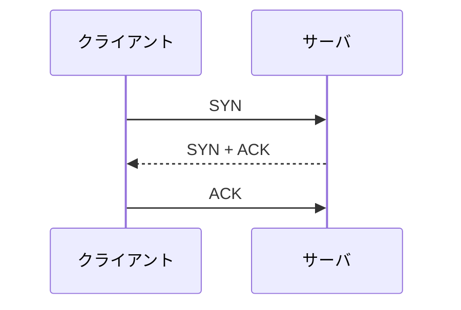

# 第09章 TCPとUDP

**― アプリケーションへデータを届ける二つの方法 ―**

> この章では、TCPとUDPが必要な理由とTCPが提供する信頼性を中心に学びます。

------------------------------------------------------------------------

# 1. この章で学べること

- TCPとUDPが必要な理由
- TCPが提供する信頼性
- 3ウェイハンドシェイク、ACK、再送、終了
- UDPが軽量な理由と適した用途
- Linuxで接続状態とパケットを確認する方法

# 2. この章の位置付け

第2部の前章までに、IPがネットワーク間でパケットを届ける仕組みを学びました。本章では、その上で動作し、端末内のアプリケーション同士へデータを届けるトランスポート層のTCPとUDPを扱います。

# 3. なぜこの技術が必要になったのか

IPは宛先端末までの配送を試みますが、同じ端末で動く複数アプリケーションの区別、データの順序、欠落時の再送までは保証しません。用途に応じて信頼性や軽さを選べる仕組みが必要になり、TCPとUDPが使われます。

# 4. 技術の概要

**TCP（Transmission Control Protocol）**は接続を確立し、順序制御、受信確認、再送によって信頼性のあるバイト列を提供します。**UDP（User Datagram Protocol）**は接続確立や再送を標準では行わず、短いヘッダでデータグラムを送ります。「UDPは必ず高速」ではなく、遅延を抑えやすく、必要な制御をアプリケーション側で選べる点が特徴です。

# 5. 詳しい仕組み

## TCPの3ウェイハンドシェイク

TCPは通信開始時にSYNとACKのフラグを使って接続を確立します。



## シーケンス番号とACK

TCPは送信データの位置を**シーケンス番号（Sequence Number）**で管理します。受信側は次に受け取りたい番号をACKで知らせます。一定時間内に確認できないデータは再送されます。重複や順序の入れ替わりもTCPが整理します。

## フロー制御と輻輳制御

受信側が処理できる量に合わせる仕組みがフロー制御、ネットワークの混雑へ送信量を適応させる仕組みが**輻輳制御（Congestion Control）**です。両者は目的が異なります。

## コネクション終了

通常はFINとACKを双方が交換して終了します。異常時にはRSTで接続を即座に終了する場合があります。終了後にTIME-WAIT状態が残るのは、遅れて届くセグメントを安全に扱うためです。

## UDPを選ぶ場面

UDPはDNSの短い問い合わせ、音声・映像、時刻同期などで利用されます。多少の損失より遅延を避けたい通信や、一回の要求と応答で済む通信に適します。ただし、必要ならアプリケーションプロトコルが再送や暗号化を実装します。

# 6. Linuxではどうなるか

```bash
# TCP/UDPソケットを確認
ss -tunap

# TCPハンドシェイクを4パケットだけ観察
sudo tcpdump -i any -nn -c 4 'tcp port 443'

# TCP統計を確認
nstat -az TcpRetransSegs
```

従来は `netstat -ant` も使われましたが、現在のLinuxでは同等の情報を得られる `ss` を基本とします。古い運用手順を読む際にコマンド名を知っておく程度で構いません。

代表的な出力例（必要な部分のみ抜粋）

```text
$ ss -tunap
tcp ESTAB 192.0.2.10:52144 198.51.100.20:443 users:(("curl",pid=1200,fd=5))
udp UNCONN 0.0.0.0:5353 0.0.0.0:*

$ sudo tcpdump -i any -nn -c 4 'tcp port 443'
192.0.2.10.52144 > 198.51.100.20.443: Flags [S], seq 1000
198.51.100.20.443 > 192.0.2.10.52144: Flags [S.], seq 5000, ack 1001
192.0.2.10.52144 > 198.51.100.20.443: Flags [.], ack 5001

$ nstat -az TcpRetransSegs
TcpRetransSegs  3
```

確認ポイント

- `ESTAB` はTCP接続済み、`UNCONN` はUDPでよく表示される未接続状態です。
- `[S]`、`[S.]`、`[.]` がSYN、SYN+ACK、ACKの流れです。
- `ack 1001` は、次に1001番から受け取りたいことを示します。
- `TcpRetransSegs` は累積再送数です。障害中に増えるかを比較します。

# 7. 実務ではどう使われるか

## 実務コラム：接続が遅い

SYNを送ってもSYN+ACKが返らず再送している場合、経路、Firewall、サーバの待受を確認します。接続後に再送が増える場合は、損失、混雑、MTUなどを調べます。

```bash
ss -tn state syn-sent
sudo tcpdump -i any -nn 'tcp port 443'
```

代表的な出力例（必要な部分のみ抜粋）

```text
$ ss -tn state syn-sent
SYN-SENT 192.0.2.10:52144 198.51.100.20:443
```

確認ポイント

- `SYN-SENT` が長く残れば、接続要求への応答を受け取れていません。
- 送信SYNだけか、SYN+ACKまで返るかをパケットで確認します。

# 8. FE/APではどう問われるか

TCPの信頼性、3ウェイハンドシェイク、シーケンス番号、ACK、再送、TCPとUDPの違いが問われます。用途から選択理由を説明できるようにします。

# 9. まとめ

- TCPは接続を確立し、順序制御・ACK・再送で信頼性を提供します。
- UDPは制御を最小限にし、用途に応じた処理をアプリケーションへ委ねます。
- 通信障害では接続状態とパケットの両方を確認します。

# 10. 理解度チェック

1. TCPの信頼性を支える仕組みを三つ挙げてください。
2. 3ウェイハンドシェイクの順序を答えてください。
3. UDPが音声通信などで使われる理由を説明してください。

# 11. 解答・解説

## 問1

シーケンス番号による順序管理、ACKによる受信確認、欠落時の再送などです。

## 問2

SYN、SYN+ACK、ACKの順です。

## 問3

接続確立や標準の再送を行わず、古いデータの再送より新しいデータを優先する設計を取りやすいためです。

# 12. 実務で考えてみよう

## ケース：TCP接続で再送が増えている

### 解答例

送信元・宛先の両側でパケットを観察し、どの区間で欠落するかを絞ります。インターフェースエラー、混雑、MTU、Firewallのタイムアウトも確認します。再送があるだけで原因を断定せず、増加率と利用者影響を見ます。

# 13. 次章へのつながり

次章では、同じ端末内のどのアプリケーションへTCP/UDPデータを渡すかを決めるポート番号を学びます。

------------------------------------------------------------------------

# レビュー状況（執筆メモ）

- 執筆：完了
- レビュー①（章レビュー）：未実施
- レビュー②（部レビュー）：第3部完成後に実施予定
