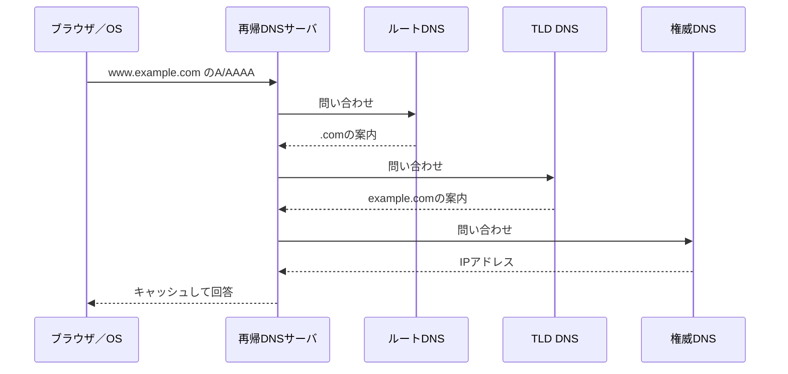

# 第03章 DNS

**― 名前から接続先を見つける分散データベース ―**

> この章では、DNSが必要な理由と名前解決の問い合わせの流れを中心に学びます。

------------------------------------------------------------------------

# 1. この章で学べること

- DNSが必要な理由
- 名前解決の問い合わせの流れ
- リゾルバ、権威DNSサーバ、キャッシュ
- 主要なDNSレコード
- Linuxで問い合わせ結果を読む方法

# 2. この章の位置付け

TCP/IP通信には宛先IPアドレスが必要です。しかし利用者は通常、URLのホスト名を入力します。本章では、ブラウザが接続先IPアドレスを知るまでを扱います。

# 3. なぜこの技術が必要になったのか

IPアドレスを人がすべて記憶するのは困難で、サーバ移転で値が変わるたび利用者へ知らせる方法も非効率です。名前と各種情報を分散管理し、必要なときに問い合わせるDNSが使われます。

# 4. 技術の概要

**DNS（Domain Name System）**は、ドメイン名に対応するIPアドレスなどを検索する分散データベースです。アプリケーションから名前解決を依頼される機能を**リゾルバ（Resolver）**、問い合わせに最終的な情報を答えるサーバを**権威DNSサーバ（Authoritative DNS Server）**と呼びます。

# 5. 詳しい仕組み

## 名前解決の流れ

ブラウザが `www.example.com` を開くとき、OSの設定に従ってキャッシュやhostsファイルを確認し、必要なら再帰DNSサーバへ問い合わせます。再帰DNSサーバはキャッシュになければ、ルート、TLD、対象ドメインの権威DNSサーバをたどります。



## 主なレコード

| レコード | 役割 |
|---|---|
| A | 名前にIPv4アドレスを対応付ける |
| AAAA | 名前にIPv6アドレスを対応付ける |
| CNAME | 別名を正式名へ対応付ける |
| MX | メール配送先を示す |
| NS | ゾーンを管理するDNSサーバを示す |
| TXT | 任意文字列。ドメイン所有確認やメール認証にも利用 |
| PTR | IPアドレスから名前を引く逆引きに利用 |

## キャッシュとTTL

DNSレコードの**TTL**はキャッシュしてよい秒数です。IPのTTLとは名前が同じでも役割が異なります。変更直後は古いキャッシュが残り、利用者ごとに異なる結果が見える場合があります。

## UDPとTCP

通常の問い合わせにはUDP 53番が多く使われます。応答が大きい場合やゾーン転送などではTCPも使われます。DNSを「UDPだけ」と覚えないようにします。

# 6. Linuxではどうなるか

```bash
# OSと同じ名前解決経路で確認
getent ahosts www.example.com

# DNSレコードと応答情報を確認
dig www.example.com A
dig www.example.com AAAA

# 参考：対話的な確認
nslookup www.example.com
```

代表的な出力例（必要な部分のみ抜粋）

```text
$ dig www.example.com A
;; ->>HEADER<<- opcode: QUERY, status: NOERROR, id: 1234
;; flags: qr rd ra; QUERY: 1, ANSWER: 1

;; ANSWER SECTION:
www.example.com. 300 IN A 192.0.2.80

;; Query time: 18 msec
;; SERVER: 192.0.2.53#53

$ getent ahosts www.example.com
192.0.2.80 STREAM www.example.com
```

確認ポイント

- `status: NOERROR` は問い合わせ処理が成功したことを示します。レコードが存在することとは別です。
- ANSWER SECTIONの `300` がDNSキャッシュのTTL、`A` の後ろがIPv4アドレスです。
- `SERVER` は問い合わせに利用したDNSサーバです。
- `getent` は `/etc/hosts` なども含むOSの名前解決設定に従うため、アプリケーションに近い確認です。

# 7. 実務ではどう使われるか

## 実務コラム：DNS変更が一部利用者へ反映されない

権威DNSを更新しても、以前のTTLが切れるまで再帰DNSサーバや端末に古い情報が残る場合があります。

```bash
dig www.example.com A
dig @192.0.2.53 www.example.com A
getent ahosts www.example.com
```

代表的な出力例（必要な部分のみ抜粋）

```text
$ dig www.example.com A
www.example.com. 120 IN A 192.0.2.80

$ dig @192.0.2.53 www.example.com A
www.example.com. 3600 IN A 192.0.2.81
```

確認ポイント

- 問い合わせ先ごとの回答と残りTTLを比較します。
- 権威情報、再帰DNSのキャッシュ、OSが実際に使う結果を分けて調べます。

# 8. FE/APではどう問われるか

DNSの階層、再帰問い合わせ、キャッシュ、A・AAAA・CNAME・MX・NS、UDP/TCP 53番が問われます。ブラウザがIPアドレスを得るまでの順序で理解します。

# 9. まとめ

- DNSは名前とIPアドレスなどを対応付ける分散データベースです。
- 再帰DNSサーバは必要に応じて権威DNSサーバをたどり、回答をキャッシュします。
- DNSのTTLとIPのTTLは別の意味です。

# 10. 理解度チェック

1. ブラウザがホスト名からIPアドレスを得る流れを説明してください。
2. AとAAAAレコードの違いは何ですか。
3. DNS変更がすぐ全利用者へ反映されない理由は何ですか。

# 11. 解答・解説

## 問1

OSのリゾルバが設定された再帰DNSサーバへ問い合わせ、必要に応じてルート、TLD、権威DNSをたどった回答を受け取ります。

## 問2

AはIPv4アドレス、AAAAはIPv6アドレスを対応付けます。

## 問3

再帰DNSサーバや端末がTTLの範囲で古い回答をキャッシュするためです。

# 12. 実務で考えてみよう

## ケース：IPアドレスでは接続できるが名前では失敗する

### 解答例

`getent` でOSの名前解決結果、`dig` でDNS応答とステータス、`/etc/nsswitch.conf` やDNSサーバ設定を確認します。A/AAAAの片方だけが誤っている可能性もあります。

# 13. 次章へのつながり

次章では、接続先が正しい相手かを証明し、通信を暗号化するTLS/SSLを学びます。

------------------------------------------------------------------------

# レビュー状況（執筆メモ）

- 執筆：完了
- レビュー①（章レビュー）：未実施
- レビュー②（部レビュー）：第3部完成後に実施予定
