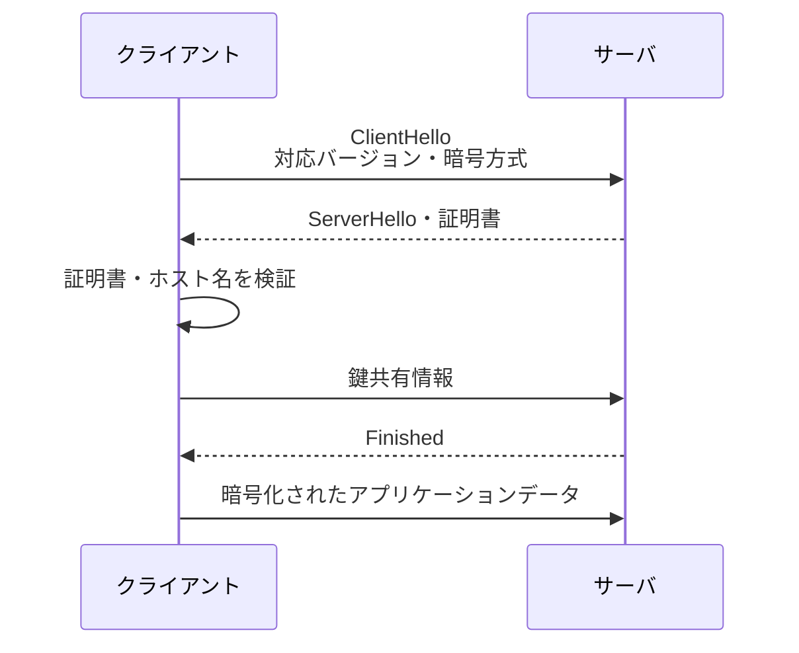

# 第04章 TLS／SSL

**― 相手を確かめ、通信内容を暗号化する ―**

> この章では、平文通信の問題とTLSが必要な理由を中心に学びます。

------------------------------------------------------------------------

# 1. この章で学べること

- 平文通信の問題とTLSが必要な理由
- 証明書によるサーバ認証
- TLSハンドシェイクと共通鍵暗号
- SSLとTLSの関係
- Linuxで証明書と接続を確認する方法

# 2. この章の位置付け

DNSで接続先IPアドレスを得てTCP接続しても、相手が本物か、途中で盗聴・改ざんされないかは保証されません。本章ではHTTPなどを保護するTLSを扱います。

# 3. なぜこの技術が必要になったのか

暗号化しない通信では、経路上で内容を読まれたり書き換えられたりする可能性があります。また、攻撃者のサーバへ誘導されたとき、見た目だけでは本物か判断できません。認証・暗号化・改ざん検知を提供する仕組みが必要です。

# 4. 技術の概要

**TLS（Transport Layer Security）**は、証明書などによる通信相手の認証、通信内容の暗号化、改ざん検知を提供します。**SSL（Secure Sockets Layer）**はTLSの前身で、SSL 2.0・3.0は安全ではなく使用しません。現在の通信を慣用的に「SSL」と呼ぶ場合も、実際にはTLSを指すことが多いです。

# 5. 詳しい仕組み

## 証明書と認証局

サーバ証明書には対象ホスト名、公開鍵、有効期限、発行者などが含まれます。クライアントは信頼する**認証局（Certificate Authority: CA）**から証明書チェーンを検証し、接続先ホスト名と証明書のSubject Alternative Nameが一致するか確認します。

## TLSハンドシェイク



現代のTLSでは公開鍵暗号などを使って安全に鍵を共有し、その後の大量データは高速な**共通鍵暗号（Symmetric-key Cryptography）**で保護します。実際のメッセージはTLSバージョンにより異なります。

## TLSが保証しないこと

TLSは通信路を保護しますが、接続先アプリケーション自体が安全であること、入力した情報の利用方法、端末がマルウェアに感染していないことまでは保証しません。

# 6. Linuxではどうなるか

```bash
# 証明書とTLS接続を確認
openssl s_client -connect www.example.com:443 -servername www.example.com </dev/null

# curlでTLSを含む接続過程を確認
curl -vI https://www.example.com/
```

代表的な出力例（必要な部分のみ抜粋）

```text
$ openssl s_client -connect www.example.com:443 -servername www.example.com
subject=CN = www.example.com
issuer=CN = Example CA
Verification: OK
Protocol  : TLSv1.3
Cipher    : TLS_AES_256_GCM_SHA384

$ curl -vI https://www.example.com/
* SSL connection using TLSv1.3
*  subjectAltName: host "www.example.com" matched
< HTTP/2 200
```

確認ポイント

- `Verification: OK` は証明書チェーン検証が成功した例です。
- `Protocol` と `Cipher` でTLSバージョンと暗号スイートを確認します。
- ホスト名一致、有効期限、発行者も確認します。
- `-k` で検証を無効化すると問題を隠すため、通常の確認では使いません。

# 7. 実務ではどう使われるか

## 実務コラム：証明書エラー

期限切れ、ホスト名不一致、中間証明書不足、端末時刻のずれなどで検証に失敗します。

```bash
openssl s_client -connect service.example.com:443 -servername service.example.com </dev/null
date -Is
```

代表的な出力例（必要な部分のみ抜粋）

```text
Verify return code: 10 (certificate has expired)
notAfter=Jul 20 00:00:00 2026 GMT
```

確認ポイント

- `Verify return code` と `notAfter` から失敗理由と期限を確認します。
- 更新前に証明書チェーン、秘密鍵との対応、対象ホスト名を検証します。

# 8. FE/APではどう問われるか

TLSの目的、公開鍵暗号と共通鍵暗号の使い分け、証明書・認証局、SSLとの関係が問われます。暗号化だけでなく認証と改ざん検知も説明できるようにします。

# 9. まとめ

- TLSは相手の認証、暗号化、改ざん検知を提供します。
- 証明書は信頼する認証局からのチェーンとホスト名で検証します。
- SSLは旧方式で、現在はTLSを使用します。

# 10. 理解度チェック

1. TLSが提供する主な機能を三つ答えてください。
2. 大量データの暗号化に共通鍵暗号を使う理由は何ですか。
3. 証明書検証で確認する項目を三つ挙げてください。

# 11. 解答・解説

## 問1

通信相手の認証、通信内容の暗号化、改ざん検知です。

## 問2

公開鍵暗号より高速に処理できるためです。

## 問3

信頼できる証明書チェーン、ホスト名一致、有効期限などです。

# 12. 実務で考えてみよう

## ケース：ブラウザで証明書警告が出る

### 解答例

警告を無視せず、対象ホスト名、期限、発行者、証明書チェーン、端末時刻を確認します。攻撃による差し替えの可能性もあるため、本番では検証無効化を恒久対応にしません。

# 13. 次章へのつながり

次章では、Webクライアントとサーバが要求と応答を交換するHTTPを学びます。

------------------------------------------------------------------------

# レビュー状況（執筆メモ）

- 執筆：完了
- レビュー①（章レビュー）：未実施
- レビュー②（部レビュー）：第3部完成後に実施予定
