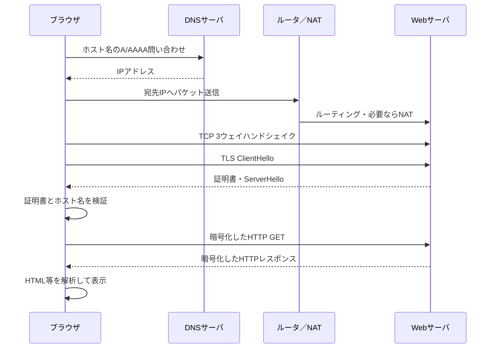

# 第06章 HTTPS

**― URL入力から安全なWebページ表示まで ―**

> この章では、HTTPSがHTTPを保護する仕組みを中心に学びます。

------------------------------------------------------------------------

# 1. この章で学べること

- HTTPSがHTTPを保護する仕組み
- DNS・TCP・TLS・HTTPの連携
- ブラウザでURLを開く一連の流れ
- NATやルーティングとの接続
- Linuxで各段階を切り分ける方法

# 2. この章の位置付け

これまでDNS、TCP、TLS、HTTPを個別に学びました。本章では知識をつなぎ、ブラウザにHTTPS URLを入力してからページが表示されるまでを追います。

# 3. なぜこの技術が必要になったのか

HTTPを平文のまま使うと認証情報や内容を盗聴・改ざんされる可能性があります。Webの要求と応答をTLSで保護し、接続先を確認するHTTPSが必要です。

# 4. 技術の概要

**HTTPS（Hypertext Transfer Protocol Secure）**は、HTTPをTLSで保護した通信です。通常はTCP 443番を使います。HTTP/3ではQUICとTLS 1.3をUDP上で統合しますが、DNSで接続先を知り、相手を認証し、HTTP要求を送る目的は同じです。

# 5. 詳しい仕組み

## URL入力から表示まで



## 第2部との接続

端末はDHCPで得たIPアドレス、プレフィックス長、DNSサーバ、デフォルトゲートウェイを使います。DNSサーバやWebサーバへの経路を選び、別ネットワークならゲートウェイのMACアドレスをARPで調べます。家庭ではNATで送信元がグローバルIPv4アドレスへ変換される場合があります。

## 一つのページで複数通信

HTML表示後、CSS、JavaScript、画像、APIなど別の資源も取得します。別ホスト名なら追加のDNS問い合わせや接続が発生します。接続再利用やHTTP/2の多重化により、必ず資源ごとに新しいTCP接続を作るわけではありません。

## HTTPSでも見える情報

TLSはHTTPの内容を暗号化しますが、通信相手のIPアドレス、通信量、タイミングなどは経路上から観測され得ます。DNSも暗号化方式を使わなければ問い合わせ名が見えます。

# 6. Linuxではどうなるか

```bash
# 名前解決
getent ahosts www.example.com

# 経路選択
ip route get 192.0.2.80

# TLSとHTTPを含む詳細
curl -vI https://www.example.com/

# 段階別時間
curl -sS -o /dev/null -w 'dns=%{time_namelookup} tcp=%{time_connect} tls=%{time_appconnect} total=%{time_total}\n' https://www.example.com/
```

代表的な出力例（必要な部分のみ抜粋）

```text
$ curl -vI https://www.example.com/
* Host www.example.com:443 was resolved.
*   Trying 192.0.2.80:443...
* Connected to www.example.com port 443
* SSL connection using TLSv1.3
*  subjectAltName: host "www.example.com" matched
> HEAD / HTTP/2
< HTTP/2 200

$ curl -sS -o /dev/null -w ...
dns=0.012 tcp=0.028 tls=0.061 total=0.104
```

確認ポイント

- `resolved`、`Trying`、`Connected`、TLS、HTTP応答の順に成功段階を確認します。
- 時刻は開始から各段階までの累積秒数です。差分を見て遅い段階を判断します。
- 証明書のホスト名一致と検証成功を確認します。

# 7. 実務ではどう使われるか

## 実務コラム：Webページが開かない

一つの原因に決めつけず、名前解決、経路、TCP、TLS、HTTPの順に観測します。

```bash
getent ahosts service.example.com
ip route get 192.0.2.80
curl -vI https://service.example.com/
```

代表的な出力例（必要な部分のみ抜粋）

```text
* Host service.example.com:443 was resolved.
* connect to 192.0.2.80 port 443 failed: Connection timed out
```

確認ポイント

- 名前解決は成功し、TCP接続段階で停止しています。
- 経路、Firewall、NAT、サーバ待受を優先して確認し、TLSやHTTP設定は後に切り分けます。

# 8. FE/APではどう問われるか

HTTPSがHTTPをTLSで保護すること、DNS→TCP→TLS→HTTPの順序、証明書検証、ポート443が問われます。各技術の役割を一連の通信として説明します。

# 9. まとめ

- HTTPSはHTTPをTLSで保護します。
- URL入力後はDNS、経路選択、TCP、TLS、HTTPが連携します。
- 障害調査では、どの段階まで成功したかを観測します。

# 10. 理解度チェック

1. HTTPSページ表示までの主要な処理を順に説明してください。
2. DHCP、ARP、NATはこの通信へどう関係しますか。
3. curlの`Connected`後、証明書エラーになった場合はどの段階の問題ですか。

# 11. 解答・解説

## 問1

DNS名前解決、経路選択、TCP接続、TLSハンドシェイクと証明書検証、HTTP要求・応答、描画です。

## 問2

DHCPは端末設定を配り、ARPは次ホップのMACを解決し、NATは必要に応じて境界でアドレス・ポートを変換します。

## 問3

TCP接続は成立しており、TLSの証明書検証段階の問題です。

# 12. 実務で考えてみよう

## ケース：初回だけ表示が遅い

### 解答例

DNS、TCP、TLSの初回処理と、再利用・キャッシュ後の差を測ります。curlの段階別時間、DNS TTL、TLSセッション再開、HTTPキャッシュを比較します。

# 13. 次章へのつながり

次章では、Linux実務でサーバを安全に遠隔操作するSSHを学びます。

------------------------------------------------------------------------

# レビュー状況（執筆メモ）

- 執筆：完了
- レビュー①（章レビュー）：未実施
- レビュー②（部レビュー）：第3部完成後に実施予定
