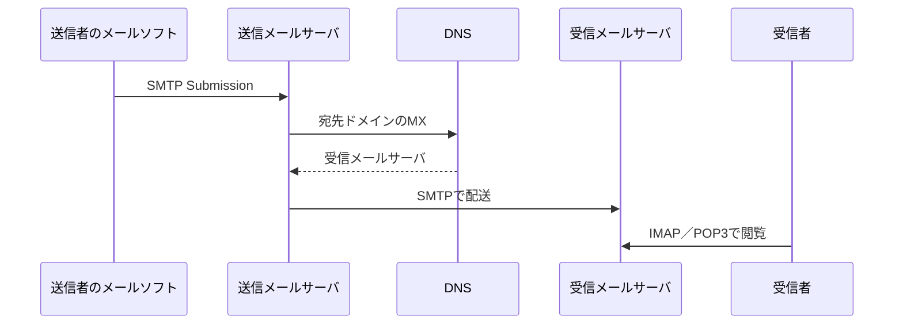

# 第09章 メールプロトコル

**― 送信と受信を分担するSMTP・POP3・IMAP ―**

> この章では、メール配送に複数プロトコルが必要な理由を中心に学びます。

------------------------------------------------------------------------

# 1. この章で学べること

- メール配送に複数プロトコルが必要な理由
- SMTPによる送信・中継
- POP3とIMAPの違い
- DNSのMXレコードとの関係
- Linuxで接続とTLSを確認する方法

# 2. この章の位置付け

WebやSSHと同様、メールもIP・TCP・DNS・TLSの上で動作します。本章では送信と受信を分けるアプリケーションプロトコルを扱います。

# 3. なぜこの技術が必要になったのか

送信者から受信者のサーバへメールを運ぶ処理と、利用者が保存済みメールを読む処理では役割が異なります。常時接続しない端末も利用できるよう、サーバ間配送とメールボックスアクセスを分担します。

# 4. 技術の概要

**SMTP（Simple Mail Transfer Protocol）**はメールの送信・中継、**POP3（Post Office Protocol version 3）**と**IMAP（Internet Message Access Protocol）**は受信者がメールボックスへアクセスするために使います。現代ではTLSで保護し、利用者送信には認証を組み合わせます。

# 5. 詳しい仕組み

## メールが届く流れ



## SMTP

サーバ間配送はTCP 25番、利用者からの送信受付は587番（Submission）が代表的です。暗号化専用の465番も使われます。オープンリレーは迷惑メールに悪用されるため、認証と中継制限が必要です。

## POP3とIMAP

POP3はメールを端末へ取得する単純な利用に向きます。IMAPはサーバ上のメールボックス、フォルダ、既読状態を同期し、複数端末で使いやすい方式です。

代表的な暗号化ポートはPOP3S 995番、IMAPS 993番です。平文ポート上でSTARTTLSにより暗号化へ切り替える方式もあります。

## DNSとの関係

送信メールサーバは宛先ドメインのMXレコードを検索します。MXは優先度と配送先ホスト名を示し、そのホスト名のA/AAAAも解決します。

# 6. Linuxではどうなるか

```bash
# MXレコードを確認
dig example.com MX

# SMTP SubmissionのTLSを確認
openssl s_client -connect mail.example.com:587 -starttls smtp -servername mail.example.com </dev/null

# IMAPSの接続を確認
openssl s_client -connect mail.example.com:993 -servername mail.example.com </dev/null
```

代表的な出力例（必要な部分のみ抜粋）

```text
$ dig example.com MX
example.com. 300 IN MX 10 mail.example.com.

$ openssl s_client -connect mail.example.com:587 -starttls smtp ...
Verification: OK
250-STARTTLS
Protocol  : TLSv1.3
```

確認ポイント

- MXの数値が小さい配送先ほど優先度が高いのが一般的です。
- MXの右側はIPアドレスではなくホスト名です。
- `Verification: OK`、ホスト名、有効期限、TLSバージョンを確認します。
- 認証情報やメール本文を試験環境以外へ送らないようにします。

# 7. 実務ではどう使われるか

## 実務コラム：送信できるが受信できない

送信と受信は別経路です。MX、受信サーバのTCP 25番、迷惑メール判定、メールボックス容量、IMAP接続を分けて確認します。

```bash
dig example.com MX
ss -lntp
journalctl --since '10 minutes ago' -u postfix
```

代表的な出力例（必要な部分のみ抜粋）

```text
status=bounced (Host or domain name not found)
```

確認ポイント

- ログの時刻、宛先、キューID、最終ステータスを確認します。
- 個人情報や本文を含むログの共有範囲に注意します。

# 8. FE/APではどう問われるか

SMTP・POP3・IMAPの役割、代表ポート、MXレコード、Submission、暗号化方式が問われます。送信とメールボックス閲覧を区別します。

# 9. まとめ

- SMTPは送信・中継、POP3とIMAPはメールボックスアクセスを担当します。
- 送信サーバはDNSのMXレコードから配送先を調べます。
- 現代のメール通信ではTLS、認証、中継制限が重要です。

# 10. 理解度チェック

1. SMTP、POP3、IMAPの役割を説明してください。
2. MXレコードは何を示しますか。
3. IMAPが複数端末で使いやすい理由は何ですか。

# 11. 解答・解説

## 問1

SMTPは送信・中継、POP3とIMAPは受信者のメールボックスアクセスです。

## 問2

宛先ドメインのメール配送先ホスト名と優先度を示します。

## 問3

メールやフォルダ、既読状態をサーバ上で管理・同期するためです。

# 12. 実務で考えてみよう

## ケース：特定ドメイン宛てだけ配送できない

### 解答例

対象ドメインのMXとA/AAAA、DNS応答、配送先25番への経路、SMTP応答、送信サーバログを確認します。相手側拒否なら応答コードとポリシーを確認します。

# 13. 次章へのつながり

最終章では、第3部のプロトコルと代表ポートを整理し、URL入力からWeb表示までを自分で説明できるか確認します。

------------------------------------------------------------------------

# レビュー状況（執筆メモ）

- 執筆：完了
- レビュー①（章レビュー）：未実施
- レビュー②（部レビュー）：第3部完成後に実施予定

