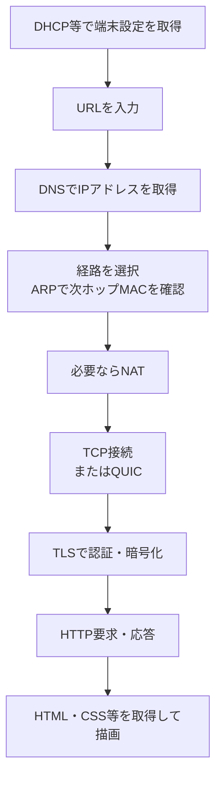

# 第10章 代表的なアプリケーションプロトコルまとめ

**― 個別の知識を一つの通信としてつなぐ ―**

> この章では、代表的なアプリケーションプロトコルの役割を中心に学びます。

------------------------------------------------------------------------

# 1. この章で学べること

- 代表的なアプリケーションプロトコルの役割
- プロトコルとポート番号の対応
- URL入力からWeb表示までの全体像
- 障害を段階ごとに切り分ける方法
- 安全性と用途からプロトコルを選ぶ視点

# 2. この章の位置付け

第3部ではTCP/UDPからWeb、遠隔操作、ファイル転送、メールまで学びました。本章では暗記表だけで終わらせず、それぞれがIPネットワーク上で連携する流れを整理します。

# 3. なぜこの技術が必要になったのか

障害や試験問題では、技術が一つだけ現れるとは限りません。DNSは成功したがTCPが失敗する、TLSは成功したがHTTPが500を返すなど、層とプロトコルをまたいで判断する力が必要です。

# 4. 技術の概要

アプリケーションプロトコルは、TCP・UDP・QUICなどの通信機能を利用し、名前解決、Web、遠隔操作、ファイル転送、メールといった目的ごとの規則を定めます。ポート番号は標準的な入口を示しますが、内容や安全性を自動的に保証しません。

# 5. 詳しい仕組み

## 代表的な対応

| プロトコル | 主な役割 | 代表的なトランスポート／ポート |
|---|---|---|
| DNS | 名前解決 | UDP/TCP 53 |
| HTTP | Web | TCP 80 |
| HTTPS | TLSで保護したWeb | TCP 443、HTTP/3はUDP 443 |
| SSH | 遠隔操作 | TCP 22 |
| SFTP | SSH上のファイル転送 | TCP 22 |
| FTP | ファイル転送 | TCP 21とデータ接続 |
| SMTP | メール送信・中継 | TCP 25、587、465 |
| POP3S | 暗号化したメール取得 | TCP 995 |
| IMAPS | 暗号化したメール同期 | TCP 993 |

## Web表示の総合フロー



## 障害切り分け

1. 端末設定：IPアドレス、経路、DNSサーバ
2. 名前解決：期待するA/AAAAか
3. 経路・到達性：次ホップ、NAT、Firewall
4. トランスポート：SYN/SYN+ACK、接続状態
5. TLS：証明書、ホスト名、期限
6. アプリケーション：HTTPコード、SSH認証、メール応答

上位の結果が返れば、下位が一定範囲まで動作した証拠になります。例えばHTTP 404は、HTTP応答を受け取るところまで成功しています。

# 6. Linuxではどうなるか

```bash
# 端末設定
ip -br address
ip route

# 名前解決
getent ahosts www.example.com

# 接続からHTTPまで
curl -vI https://www.example.com/

# ソケット
ss -tunap
```

代表的な出力例（必要な部分のみ抜粋）

```text
eth0 UP 192.0.2.10/24
default via 192.0.2.1 dev eth0
192.0.2.80 STREAM www.example.com
* Connected to www.example.com port 443
* SSL connection using TLSv1.3
< HTTP/2 200
tcp ESTAB 192.0.2.10:52144 192.0.2.80:443
```

確認ポイント

- IP設定、デフォルトルート、名前解決結果を前提として確認します。
- `Connected`、TLS、HTTPコードの順に、どこまで成功したかを読みます。
- 一つの成功・失敗だけで全層を断定しません。

# 7. 実務ではどう使われるか

## 実務コラム：事実を時系列で残す

障害時は「つながらない」だけでなく、時刻、送信元、宛先、実行コマンド、抜粋結果、期待値を記録します。認証情報や個人情報は除外します。

```bash
date -Is
ip route get 192.0.2.80
curl -sS -o /dev/null -w '%{http_code} %{time_total}\n' https://www.example.com/
```

代表的な出力例（必要な部分のみ抜粋）

```text
2026-07-21T10:30:00+09:00
192.0.2.80 via 192.0.2.1 dev eth0 src 192.0.2.10
200 0.104
```

確認ポイント

- 後から比較できるよう時刻と条件を残します。
- 正常時の基準値と比較すると変化を判断しやすくなります。

# 8. FE/APではどう問われるか

各プロトコルの役割・代表ポート・下位プロトコルと、URL入力から表示までの順序が総合的に問われます。暗記した番号を通信の意味へ結び付けます。

# 9. まとめ

- アプリケーションプロトコルは目的ごとの通信規則を定めます。
- Web表示には第1〜3部で学んだ複数技術が連携します。
- 障害調査では下位から上位へ成功段階を積み上げます。

# 10. 理解度チェック

1. URL入力からHTTPSページ表示までの流れを説明してください。
2. DNSが成功しTCP接続が失敗した場合、どこを優先して調べますか。
3. SFTPとFTP、HTTPSとHTTPの安全性の違いを説明してください。

# 11. 解答・解説

## 問1

端末設定、DNS、経路・ARP・必要ならNAT、TCPまたはQUIC、TLS、HTTP要求・応答、資源取得と描画です。

## 問2

経路、NAT、Firewall、サーバ待受など、TCP接続までの区間を調べます。

## 問3

SFTPはSSHで、HTTPSはTLSで保護されます。標準FTPとHTTPは平文であり、認証情報や内容を保護しません。

# 12. 実務で考えてみよう

## ケース：DNS・TCP・TLSは成功するがHTTP 500になる

### 解答例

ネットワーク通信とTLSは成立しています。HTTP要求内容、リバースプロキシ、アプリケーションログ、依存サービスを確認します。ネットワーク設定を無関係に変更する前に、500を生成した構成要素を特定します。

# 13. 次章へのつながり

第3部で、アプリケーション通信の一連の流れを学びました。以降は脅威、認証、暗号、監視などを通して、これらの通信をどのように守るかへ進みます。

------------------------------------------------------------------------

# レビュー状況（執筆メモ）

- 執筆：完了
- レビュー①（章レビュー）：未実施
- レビュー②（部レビュー）：第3部完成後に実施予定

