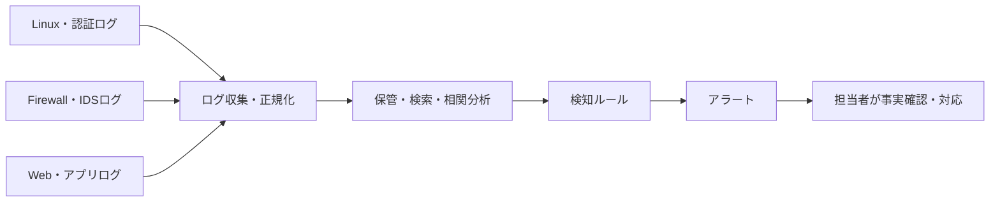

# 第02章 ログ分析と侵入検知

**― 複数の記録をつなぎ、異常の兆候を見つける ―**

> この章では、ログの役割と侵入検知の基本、Linuxでの確認方法を学びます。

------------------------------------------------------------------------

# 1. この章で学べること

- ログを残す目的と分析の前提
- IDS、IPS、SIEMの役割
- シグネチャ検知と異常検知の違い
- 誤検知・見逃しと検知ルールの改善
- Linuxで認証・サービスログを調べる方法

# 2. この章の位置付け

前章では不要な通信をファイアウォールで制限しました。しかし、許可された通信や正規の認証情報が悪用される場合もあります。本章では、システムやネットワークの記録から異常を検知し、調査につなげる方法を扱います。

# 3. なぜこの技術が必要になったのか

防御策だけで攻撃をすべて防ぐことはできません。障害や不正アクセスが起きたとき、記録がなければ「いつ、誰が、何をしたか」を確認できません。一方、ログを保存するだけでも、大量の正常記録に異常が埋もれます。

必要なログを一貫した時刻で収集し、複数の情報を関連付け、対応すべき兆候を見つける仕組みが必要です。

## 現実的なシナリオ：盗まれたVPNアカウント

フィッシングでVPNの認証情報が盗まれ、攻撃者が深夜にログインしたとします。VPNログの一件だけを見ると正規利用者の成功ログに見えるかもしれません。しかし、普段と異なる接続元、短時間の大量ファイル参照、管理者権限の利用、外部への通信を時系列で結び付けると、アカウント悪用の可能性が高まります。

境界を通過した通信も監視し、認証・端末・ファイル・ネットワークのログを関連付ける必要があるのはこのためです。MFAやアクセス制御は侵入の確率を下げ、ログ分析や侵入検知は、それらをすり抜けた兆候を見つけます。

# 4. 技術の概要

**ログ（Log）**は、認証、通信、操作、エラーなどの出来事を時刻とともに記録したものです。調査では、記録元、時刻、利用者、送信元、対象、結果を確認します。

**IDS（Intrusion Detection System）**は不審な通信や動作を検知して通知する仕組みです。**IPS（Intrusion Prevention System）**は検知に加えて遮断も行います。**SIEM（Security Information and Event Management）**は複数システムのログを集約・検索・相関分析し、監視や調査を支援します。

端末上のプロセス、ファイル、通信などを継続的に記録し、検知と調査・対応を支援する仕組みを**EDR（Endpoint Detection and Response）**といいます。ネットワーク上のIDSだけでは見えにくい、端末内部の挙動を補います。

# 5. 詳しい仕組み

## ログ収集の流れ



異なる機器の時刻がずれると、出来事の順序を誤って判断します。NTPなどで時刻を同期し、タイムゾーン、ログ形式、保存期間もそろえます。ログには個人情報や認証に関わる情報が含まれるため、閲覧権限と改ざん防止も必要です。

## シグネチャ検知と異常検知

**シグネチャ検知（Signature-based Detection）**は、既知の攻撃に特徴的な文字列や通信パターンと照合します。説明しやすい一方、未知の攻撃や変形に弱い場合があります。

**異常検知（Anomaly Detection）**は、通常時の通信量、時刻、操作などの基準から外れた動きを検知します。未知の兆候を見つけられる可能性がありますが、業務変更も異常として扱うことがあります。

## 誤検知と見逃し

正常な活動を攻撃と判断することを**誤検知（False Positive）**、攻撃を検知できないことを**見逃し（False Negative）**といいます。検知を敏感にすれば必ず良くなるわけではありません。資産の重要度と影響を踏まえ、ルール、しきい値、除外条件を継続的に調整します。

## 相関分析

一件のログだけでは判断できない場合、同じ送信元、利用者、端末、時刻帯などで複数ログを結び付けます。例えば、短時間の認証失敗、直後の成功、管理者権限の利用、外部への大量通信が同じ利用者で続けば、個別イベントより優先度が高くなります。

## 実際のインシデントから一般化した例

| 事例 | 単独ログで見える兆候 | 組み合わせて確認する情報 |
|---|---|---|
| フィッシング後のアカウント悪用 | 普段と異なる認証成功 | メール、VPN、端末、クラウド監査ログ |
| 内部不正による大量持ち出し | 大量のファイル参照 | 人事上の役割、通常量、USB・外部送信ログ |
| クラウド設定ミス | 公開設定の変更 | 変更者、変更元、対象データ、外部アクセス |
| サプライチェーン経由の侵害 | 正規ソフトのプロセス実行 | 更新時刻、署名、子プロセス、外部通信先 |

これらは一つの特徴だけで攻撃と断定できません。通常時の基準と資産の重要度を踏まえ、人が確認できる根拠とともにアラート化します。

# 6. Linuxではどう利用されるか

systemdを利用するLinuxでは、`journalctl` でシステムジャーナルを検索できます。ディストリビューションやサービスによっては `/var/log/auth.log`、`/var/log/secure`、個別サービスのログも確認します。

```bash
# sshdの直近ログをISO形式の時刻で表示
sudo journalctl -u sshd --since '30 minutes ago' -o short-iso

# 失敗したログインを確認
sudo lastb -n 5

# 現在のログインセッションを確認
who
```

代表的な出力例（必要な部分のみ抜粋）

```text
$ sudo journalctl -u sshd --since '30 minutes ago' -o short-iso
2026-07-21T14:10:03+09:00 server sshd[2140]: Failed password for invalid user admin from 198.51.100.25 port 51820 ssh2
2026-07-21T14:10:08+09:00 server sshd[2143]: Failed password for invalid user admin from 198.51.100.25 port 51842 ssh2

$ who
operator pts/0 2026-07-21 13:55 (192.0.2.10)
```

確認ポイント

- ISO形式の時刻とタイムゾーンを確認します。
- `Failed password`、利用者名、送信元IPアドレス、送信元ポートを関連付けます。
- 失敗ログだけで侵入成功とは断定せず、成功ログ、現在のセッション、変更履歴も確認します。
- ログ中の文字列を、そのまま安全なコマンドとして実行しません。

# 7. 実務ではどう役立つか

## 実務コラム：認証失敗が急増した

件数だけでなく、通常時との差、対象利用者、送信元の分散、成功の有無を調べます。インターネット公開SSHでは自動探索が日常的に届くため、アラート条件は環境に合わせます。

```bash
sudo journalctl -u sshd --since '1 hour ago' --grep 'Failed password'
sudo journalctl -u sshd --since '1 hour ago' --grep 'Accepted'
```

代表的な出力例（必要な部分のみ抜粋）

```text
sshd[2201]: Failed password for user1 from 198.51.100.25 port 52010 ssh2
sshd[2240]: Accepted publickey for user1 from 203.0.113.40 port 60120 ssh2
```

確認ポイント

- 成功した認証方式、利用者、送信元が想定どおりか確認します。
- IPアドレスだけで人物を断定せず、VPN、NAT、端末情報などと照合します。
- 調査に必要なログを保全してから、遮断や設定変更を行います。

# 8. FE/APではどう問われるか

IDSとIPSの違い、ネットワーク型とホスト型、シグネチャ検知と異常検知、SIEMによる相関分析、誤検知と見逃しが問われます。検知場所と、検知後に通知・遮断のどちらを行うかを区別します。

# 9. まとめ

- ログは時刻、主体、対象、結果を追跡できるよう収集・保護します。
- IDSは検知、IPSは検知と遮断、SIEMはログの集約と相関分析を支援します。
- アラートは調査の出発点であり、複数の事実から判断します。

# 10. 理解度チェック

1. IDSとIPSの主な違いを説明してください。
2. シグネチャ検知と異常検知にはどのような長所と注意点がありますか。
3. ログ分析で時刻同期が重要なのはなぜですか。

# 11. 解答・解説

## 問1

IDSは不審な動作を検知して通知し、IPSは検知した通信の遮断まで行います。

## 問2

シグネチャ検知は既知パターンを説明しやすい一方、未知の変形を見逃す場合があります。異常検知は未知の兆候を見つけられる可能性がありますが、正常な業務変化を誤検知する場合があります。

## 問3

複数の機器やサービスで起きた出来事の順序と因果関係を正しく関連付けるためです。

# 12. 実務で考えてみよう

## ケース：深夜に管理者ログイン成功が記録された

### 解答例

利用者へ別経路で確認し、認証方式、送信元、VPN、端末、直前の失敗、ログイン後の操作を関連付けます。侵害の可能性があれば証拠を保全し、セッションや認証情報の扱いをインシデント対応手順に従って判断します。

# 13. 次章へのつながり

ログやIDSが異常を示した後は、影響を抑えながら事実を確認し、復旧する必要があります。次章ではインシデント対応の一連の流れを学びます。

------------------------------------------------------------------------

# レビュー状況（執筆メモ）

- 執筆：完了
- レビュー①（章レビュー）：未実施
- レビュー②（部レビュー）：第4部完成後に実施予定
- 実例重視方針：反映済み（2026-07-21）
