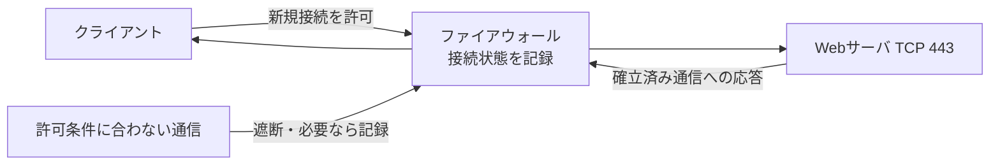

# 第01章 ファイアウォールとゼロトラスト

**― 通信を必要な範囲へ絞り、接続後も信頼を確認する ―**

> この章では、通信制御の基本と、場所だけを根拠に信頼しない設計を学びます。

------------------------------------------------------------------------

# 1. この章で学べること

- ファイアウォールが必要になった背景
- パケットフィルタリングとステートフルインスペクション
- デフォルト拒否、最小権限、ネットワーク分離
- ゼロトラストの考え方
- Linuxで通信許可と遮断を確認する方法

# 2. この章の位置付け

第1～3部では、IP、TCP/UDP、ポート番号、DNS、HTTPSなど、通信を成立させる仕組みを学びました。本章からは、その通信を必要な利用者・端末・サービスだけに許可する方法を扱います。

# 3. なぜこの技術が必要になったのか

すべての端末がすべてのサービスへ接続できるネットワークでは、一台の侵害が別システムへ広がりやすくなります。また、外部から内部を守るだけでは、認証情報の窃取、持ち込み端末、クラウド利用、内部不正へ十分に対応できません。

そこで、不要な通信を境界や端末で遮断するファイアウォールと、接続元の場所だけで信頼せずアクセスのたびに条件を確認するゼロトラストの考え方が必要になります。

# 4. 技術の概要

**ファイアウォール（Firewall）**は、送信元・宛先IPアドレス、プロトコル、ポート番号、通信状態などの条件に基づいて通信を許可または遮断する仕組みです。ルータ、専用機器、クラウド、Linuxホストなど複数の場所に配置できます。

**ゼロトラスト（Zero Trust）**は、「社内ネットワークだから安全」と暗黙に信頼せず、利用者、端末、接続先、状況を継続的に確認し、必要最小限のアクセスだけを許可する設計思想です。特定製品の名前ではありません。

# 5. 詳しい仕組み

## パケットフィルタリング

通信のヘッダ情報をルールと照合して許可・遮断します。例えば、管理用ネットワークからサーバのTCP 22番だけを許可できます。ルールは一般に上から評価されるため、条件の順序と適用方向が重要です。

## ステートフルインスペクション

**ステートフルインスペクション（Stateful Inspection）**は、個々のパケットだけでなく接続状態も追跡する方式です。内部から開始したTCP通信への戻りパケットを許可し、外部から突然届いた不正なパケットを区別できます。



UDPはTCPのような接続確立を行いませんが、ファイアウォールは送信後の一定時間、送信元・宛先などの対応を疑似的な状態として管理できます。

## デフォルト拒否と最小権限

**デフォルト拒否（Default Deny）**は、必要と確認できた通信だけを許可し、それ以外を拒否する方針です。最初から広く許可して例外だけを拒否するより、攻撃対象を減らしやすくなります。ただし、運用・監視・名前解決・時刻同期などの依存通信を把握せず適用すると、正規業務も停止します。

## ネットワーク分離

利用目的や重要度に応じてネットワークを分け、区間をまたぐ通信を制御することを**ネットワーク分離（Network Segmentation）**といいます。利用者端末、サーバ、管理系、開発環境などを分けると、侵害時の横展開を抑えられます。

## ゼロトラストの判断要素

ゼロトラストでは、認証済みかだけで判断を終えません。利用者の役割、端末の管理状態、接続時刻、接続元、対象データの重要度などを組み合わせます。アクセス後もログや端末状態を確認し、条件が変われば再認証や遮断を行います。

# 6. Linuxではどう利用されるか

Linuxでは `nftables` がカーネルのパケットフィルタリング機能を設定する代表的な仕組みです。ディストリビューションによっては `firewalld` や `ufw` が管理用の窓口になります。

```bash
# 現在のnftablesルールを表示
sudo nft list ruleset

# TCP 443番の待受を確認
ss -lntp 'sport = :443'

# firewalldを利用する環境で有効なゾーンを確認
sudo firewall-cmd --get-active-zones
```

代表的な出力例（必要な部分のみ抜粋）

```text
$ sudo nft list ruleset
table inet filter {
  chain input {
    type filter hook input priority filter; policy drop;
    ct state established,related accept
    tcp dport 443 accept
  }
}

$ ss -lntp 'sport = :443'
LISTEN 0 511 0.0.0.0:443 0.0.0.0:* users:(("nginx",pid=820,fd=6))
```

確認ポイント

- `policy drop` は、個別に許可されなかった入力通信を拒否する方針です。
- `established,related` は確立済み通信と関連通信の戻りを許可します。
- `tcp dport 443 accept` はTCP 443番宛てを許可します。
- ファイアウォールで許可されていても、サービスが待受していなければ接続できません。

設定変更は現在のSSH接続を遮断する可能性があります。コンソールなどの復旧手段、既存ルール、永続化方法を確認してから実施します。

# 7. 実務ではどう役立つか

## 実務コラム：許可したのに接続できない

通信失敗をすべてファイアウォールのせいにせず、DNS、経路、サービス待受、ホスト側と境界側のルールを分けて確認します。

```bash
ip route get 192.0.2.80
ss -lntp 'sport = :443'
sudo nft list chain inet filter input
```

代表的な出力例（必要な部分のみ抜粋）

```text
192.0.2.80 via 192.0.2.1 dev eth0 src 192.0.2.10
LISTEN 0 511 127.0.0.1:443 0.0.0.0:* users:(("nginx",pid=820,fd=6))
```

確認ポイント

- `127.0.0.1:443` はローカル端末からだけ待ち受ける例です。
- 許可ルール、経路、待受アドレスの三つを切り分けます。
- 変更前後のルールと通信試験結果を記録します。

# 8. FE/APではどう問われるか

パケットフィルタリング、ステートフルインスペクション、デフォルト拒否、DMZ、最小権限、ゼロトラストの考え方が問われます。単にポート番号を暗記せず、どの方向の誰から誰への通信を許可するかを読み取ります。

# 9. まとめ

- ファイアウォールは条件と接続状態に基づいて通信を制御します。
- デフォルト拒否とネットワーク分離は攻撃可能な範囲を減らします。
- ゼロトラストは場所を暗黙に信頼せず、アクセス条件を継続的に確認する考え方です。

# 10. 理解度チェック

1. ステートフルインスペクションは何を記録して判断しますか。
2. デフォルト拒否を採用する目的を説明してください。
3. ゼロトラストが特定のセキュリティ製品ではないのはなぜですか。

# 11. 解答・解説

## 問1

送信元・宛先、ポート番号、TCPの状態など、通信の接続状態を記録して判断します。

## 問2

必要と確認した通信だけを許可し、想定外の通信経路と攻撃対象を減らすためです。

## 問3

利用者・端末・状況を継続的に確認し、最小権限で許可する設計思想だからです。複数の認証、端末管理、通信制御、監視を組み合わせて実現します。

# 12. 実務で考えてみよう

## ケース：Webサーバへの管理用SSHを制限する

### 解答例

管理端末が使用するネットワークからTCP 22番への通信だけを許可します。公開鍵認証、多要素認証、踏み台、操作ログも組み合わせます。適用前に管理経路と緊急時の復旧方法を確認し、外部から接続できないことも試験します。

# 13. 次章へのつながり

通信を制限しても、攻撃や誤操作を完全には防げません。次章では、残されたログから異常を見つけるログ分析と侵入検知を学びます。

------------------------------------------------------------------------

# レビュー状況（執筆メモ）

- 執筆：完了
- レビュー①（章レビュー）：未実施
- レビュー②（部レビュー）：第4部完成後に実施予定
