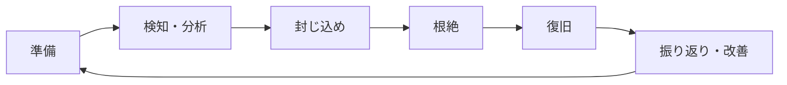

# 第03章 インシデント対応

**― 被害を抑え、事実を保全し、安全に復旧する ―**

> この章では、セキュリティインシデントへ組織的に対応する流れを学びます。

------------------------------------------------------------------------

# 1. この章で学べること

- インシデント対応が必要な理由
- 準備、検知・分析、封じ込め、根絶、復旧、振り返り
- 証拠保全と記録の基本
- Linuxで初動情報を確認する方法
- 復旧後の再発防止と改善

# 2. この章の位置付け

前章ではログや侵入検知から異常を見つける方法を学びました。本章では、異常が実際の侵害や情報漏えいの可能性を示すとき、被害を抑えながら調査し、安全な状態へ戻す方法を扱います。

# 3. なぜこの技術が必要になったのか

インシデント発生時に場当たり的な対応をすると、必要な証拠を消す、業務を過度に止める、攻撃者へ対応を気付かせる、感染を拡大させるといった問題が起こります。技術対応だけでなく、責任者、連絡先、判断基準、法令・契約上の報告も必要です。

平常時から手順と役割を準備し、事実と推測を分けて記録しながら対応する必要があります。

# 4. 技術の概要

**セキュリティインシデント（Security Incident）**は、情報資産の機密性・完全性・可用性を損なう、またはそのおそれがある事象です。マルウェア感染、不正アクセス、情報漏えい、サービス妨害、端末紛失などが含まれます。

**インシデント対応（Incident Response）**は、準備から検知・分析、封じ込め、根絶、復旧、振り返りまでを組織的に進める活動です。すべての事象を同じ強さで扱わず、影響範囲、重要度、進行状況に基づいて優先順位を決めます。

# 5. 詳しい仕組み

## 対応ライフサイクル



## 準備

連絡網、責任者、エスカレーション基準、ログ保存、バックアップ、代替手段、初動チェックリストを整えます。机上演習で、夜間や担当者不在でも判断できるか確認します。

## 検知・分析

アラートや通報を受け、発生時刻、対象資産、兆候、影響、信頼度を確認します。インシデントか未確定でも受付時刻と判断根拠を残します。情報を更新するときは、確認済みの事実、推測、未確認事項を分けます。

## 封じ込め

被害拡大を止めるため、端末隔離、アカウント停止、通信遮断などを検討します。短期的な封じ込めと、業務を維持するための代替策を分けます。いきなり電源を切るとメモリや接続状態などの揮発性情報を失うため、危険が継続している場合を除き、対応責任者と手順に従います。

## 根絶と復旧

侵入経路、マルウェア、脆弱な設定、不正アカウントなど原因を除去します。信頼できるバックアップや既知の正常イメージから復旧し、修正、認証情報の更新、動作確認、監視強化を行います。単にサービスを再起動するだけでは原因が残る場合があります。

## 振り返り

原因、影響、対応の時系列、うまく機能した点、改善点を整理します。個人を責めるためではなく、手順、監視、設計、教育へ改善を戻すことが目的です。

## 証拠保全

調査資料は取得者、取得時刻、取得元、取得方法を記録します。ファイルの**ハッシュ値（Hash Value）**を計算すると、取得後に内容が変化していないか比較できます。証拠へのアクセスや受け渡しの履歴を管理することを**証拠保全の連続性（Chain of Custody）**といいます。

# 6. Linuxではどう利用されるか

次の例は初動で状況を記録する読み取り中心のコマンドです。組織の手順と権限に従い、出力先の容量、機密情報、コマンド実行による状態変化に注意します。

```bash
# 現在時刻、ログイン、プロセス、接続を確認
date -Is
who
ps -eo pid,ppid,user,lstart,cmd --sort=lstart
ss -tunap

# 調査対象ファイルのハッシュ値を計算
sha256sum suspicious-file

# 直近の重要ログを表示
sudo journalctl --since '2026-07-21 13:00:00' --until '2026-07-21 14:00:00' -p warning
```

代表的な出力例（必要な部分のみ抜粋）

```text
$ date -Is
2026-07-21T14:20:15+09:00

$ ss -tnp
ESTAB 0 0 192.0.2.10:22 192.0.2.50:53022 users:(("sshd",pid=2143,fd=4))

$ sha256sum suspicious-file
3a7bd3e2360a3d80...  suspicious-file

$ sudo journalctl ... -p warning
2026-07-21T13:42:08+09:00 server sudo[2310]: authentication failure; user=operator
```

確認ポイント

- `date -Is` で調査時刻とタイムゾーンを記録します。
- `ss` ではローカル・接続先アドレス、ポート、プロセスを確認します。
- ハッシュ値はアルゴリズム名とともに記録し、原本を不用意に変更しません。
- 一件のログだけで原因や人物を断定しません。

# 7. 実務ではどう役立つか

## 実務コラム：不審な外部接続を見つけた

業務通信の可能性を確認しつつ、宛先、開始時刻、プロセス、利用者、親プロセス、関連ログを記録します。緊急遮断が必要か、証拠を先に取得できるかを影響度に基づいて判断します。

```bash
ss -tnp
ps -fp 2480
sudo journalctl _PID=2480 --since '1 hour ago'
```

代表的な出力例（必要な部分のみ抜粋）

```text
ESTAB 0 0 192.0.2.10:49822 203.0.113.90:443 users:(("agent",pid=2480,fd=8))
UID PID  PPID C STIME TTY TIME CMD
svc 2480 1200 0 13:48 ? 00:00:01 /opt/app/agent
```

確認ポイント

- 暗号化されたTCP 443番だから正規通信とは限りません。
- プロセスの実行元、所有者、親プロセス、構成管理上の期待値を照合します。
- 外部サービスでIPアドレスやハッシュ値を検索する前に、機密情報の持ち出し規則を確認します。

# 8. FE/APではどう問われるか

インシデント対応の順序、CSIRTの役割、封じ込めと根絶の違い、証拠保全、バックアップからの復旧、再発防止が問われます。初動で何を優先し、どの操作が証拠や業務へ影響するかを判断します。

# 9. まとめ

- インシデント対応は準備から振り返りまで続く組織的な活動です。
- 封じ込めは拡大防止、根絶は原因除去、復旧は安全な業務再開を目的とします。
- 事実と推測を分け、時刻・取得元・ハッシュ値などを記録します。

# 10. 理解度チェック

1. 封じ込めと根絶の違いを説明してください。
2. 不審端末の電源を直ちに切らない場合があるのはなぜですか。
3. 証拠ファイルのハッシュ値を記録する目的は何ですか。

# 11. 解答・解説

## 問1

封じ込めは被害の拡大を止める活動、根絶は侵入経路やマルウェアなど原因を取り除く活動です。

## 問2

メモリ、実行中プロセス、接続状態などの揮発性情報が失われるためです。ただし被害が進行している場合は封じ込めを優先します。

## 問3

取得時と分析時の値を比較し、証拠の内容が変更されていないことを確認するためです。

# 12. 実務で考えてみよう

## ケース：ランサムウェアの疑いがある端末を発見した

### 解答例

組織の手順に従って責任者へ連絡し、ネットワーク隔離などで拡大を抑えます。共有ストレージ、同じ認証情報を使う端末、バックアップへの影響を確認します。必要な証拠を保全し、侵入経路と影響範囲を調査してから、安全な環境へ復旧します。身代金対応や外部報告は個人で判断しません。

# 13. 次章へのつながり

第4部では、通信制御、検知、対応という防御の流れを学びました。これらは一度設定して終わりではなく、ログと振り返りを通じて継続的に改善します。

------------------------------------------------------------------------

# レビュー状況（執筆メモ）

- 執筆：完了
- レビュー①（章レビュー）：未実施
- レビュー②（部レビュー）：第4部完成後に実施予定
