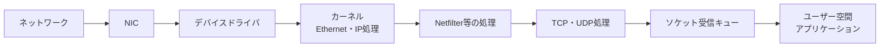

# 第01章 Linuxネットワークスタック

**― 一つのパケットがNICからアプリケーションへ届くまで ―**

> この章では、これまで学んだ各層がLinux内部でどのようにつながるかを学びます。

------------------------------------------------------------------------

# 1. この章で学べること

- カーネル空間とユーザー空間の役割
- 受信・送信パケットがLinux内部を通る流れ
- NIC、デバイスドライバ、ネットワークスタック、ソケットの関係
- 各処理を確認するLinuxコマンド
- 層を意識した障害切り分け

# 2. この章の位置付け

第1～4部ではプロトコルとセキュリティを機能ごとに学びました。第5部では知識をLinux内部の処理へ結び付けます。本章はその入口として、HTTPS応答パケットがNICへ届いてから `curl` へ渡るまでを追います。

# 3. なぜこの仕組みが必要なのか

アプリケーションが直接NICを操作すると、複数プロセスによる共有、権限管理、TCPの再送、経路選択などを個別に実装しなければなりません。Linuxカーネルが共通のネットワーク処理を提供することで、アプリケーションはソケットを通じて安全かつ一貫した方法で通信できます。

障害調査でも「ネットワークが悪い」と一括りにせず、NICまで届かない、カーネルで破棄される、ソケットは受信したがアプリケーションが読まない、という段階に分ける必要があります。

# 4. 技術の概要

**ユーザー空間（User Space）**は通常のアプリケーションが動作する領域、**カーネル空間（Kernel Space）**はOS中核がハードウェアと資源を管理する領域です。アプリケーションはシステムコールを通じてカーネルへ処理を依頼します。

Linuxの**ネットワークスタック（Network Stack）**は、Ethernet、IP、TCP/UDP、経路、フィルタリング、ソケットなどを連携させるカーネル内の処理群です。

# 5. 詳しい仕組み

## 受信の流れ



NICはフレームを受信するとメモリへデータを渡し、ドライバがカーネルへ通知します。カーネルは宛先MACアドレス、EtherType、IPヘッダを解釈し、自端末宛てならTCPやUDPへ渡します。ポート番号に対応するソケットがあれば受信キューへ格納し、アプリケーションの `read()` や `recv()` へ渡します。

Linuxカーネル内ではパケット情報を**socket buffer（`sk_buff`、通称skb）**と呼ばれるデータ構造で管理します。実装詳細は変化しますが、各処理が同じパケット情報を受け渡す入れ物と考えると全体を追いやすくなります。

## 送信の流れ

送信は概ね逆方向です。アプリケーションがソケットへデータを書き、TCP/UDPとIPがヘッダを付加し、ルーティングテーブルから出力インターフェースと次ホップを選びます。近隣情報からMACアドレスを得てフレームを作り、ドライバとNICが送信します。

## 転送されるパケット

宛先が自端末ではなくIP転送が有効なら、Linuxはルータとしてパケットを転送できます。ローカル入力、ローカル出力、転送では通るNetfilterフックが異なります。詳しくは第3章で扱います。

# 6. Linuxではどう利用されるか

```bash
# インターフェースとIPアドレス
ip -br address

# NICとドライバ情報
ethtool -i eth0

# カーネルのプロトコル統計
nstat -az IpInReceives IpInDiscards TcpInSegs

# ソケット概要
ss -s
```

代表的な出力例（必要な部分のみ抜粋）

```text
$ ip -br address
lo   UNKNOWN 127.0.0.1/8 ::1/128
eth0 UP      192.0.2.10/24

$ ethtool -i eth0
driver: virtio_net

$ nstat -az IpInReceives IpInDiscards TcpInSegs
IpInReceives  12480
IpInDiscards  0
TcpInSegs     8200

$ ss -s
TCP: 12 (estab 3, closed 5, orphaned 0, timewait 4)
```

確認ポイント

- `UP` はインターフェースが有効な例ですが、物理リンクや疎通の成功までは保証しません。
- `driver` でNICを扱うドライバを確認します。
- 統計値は累積値なので、時間を空けた差分を確認します。
- `estab` は確立中のTCPソケット数です。

# 7. 実務ではどう調査するか

## 障害例：パケットは届くがアプリケーションが応答しない

`tcpdump` で要求がNICへ届くことを確認できても、サービスが正しいアドレスで待ち受けていない、ファイアウォールで破棄される、受信キューが詰まるなどの可能性があります。

```bash
sudo tcpdump -ni eth0 -c 3 'tcp port 8080'
ss -lntp 'sport = :8080'
ss -lntmi 'sport = :8080'
```

代表的な出力例（必要な部分のみ抜粋）

```text
192.0.2.20.53000 > 192.0.2.10.8080: Flags [S], seq 1000
LISTEN 0 128 127.0.0.1:8080 0.0.0.0:* users:(("app",pid=900,fd=7))
```

確認ポイント

- SYNはNICへ届いています。
- `127.0.0.1:8080` は外部インターフェースでは待ち受けていません。
- 観測できた段階から次の処理へ進み、推測で設定を変えません。

# 8. FE/APではどう問われるか

カーネル、デバイスドライバ、プロトコル階層、カプセル化、ソケットの役割が問われます。Linux固有の名称を暗記するより、各層がどこで処理されるかを説明できるようにします。

# 9. まとめ

- LinuxカーネルはNIC、プロトコル、経路、ソケットを仲介します。
- 受信パケットはNICからソケット受信キューを経てアプリケーションへ届きます。
- 障害はインターフェース、カーネル処理、ソケット、アプリケーションに分けて調べます。

# 10. 理解度チェック

1. ユーザー空間とカーネル空間の役割を説明してください。
2. 受信パケットがアプリケーションへ届くまでを順に説明してください。
3. `tcpdump` でパケットが見えてもアプリケーションへ届かない原因を二つ挙げてください。

# 11. 解答・解説

## 問1
ユーザー空間では通常のアプリケーションが動き、カーネル空間ではOSがハードウェアとネットワーク資源を管理します。

## 問2
NIC、ドライバ、Ethernet・IP処理、必要なフィルタ、TCP/UDP、ソケット受信キュー、アプリケーションの順です。

## 問3
ファイアウォールによる破棄、待受アドレスの誤り、ソケット受信キューの枯渇などです。

# 12. 実務で考えてみよう

## ケース：受信破棄カウンタが増えている

### 解答例

増加時刻と影響を記録し、NIC統計、IP統計、ソケットキュー、CPU負荷を比較します。どの層のカウンタが増えるかで範囲を絞り、単一の累積値だけで原因を断定しません。

# 13. 次章へのつながり

次章では、アプリケーションとカーネルの接点であるSocket APIを詳しく学びます。

------------------------------------------------------------------------

# レビュー状況（執筆メモ）

- 執筆：完了
- レビュー①（章レビュー）：未実施
- レビュー②（部レビュー）：第5部完成後に実施予定
