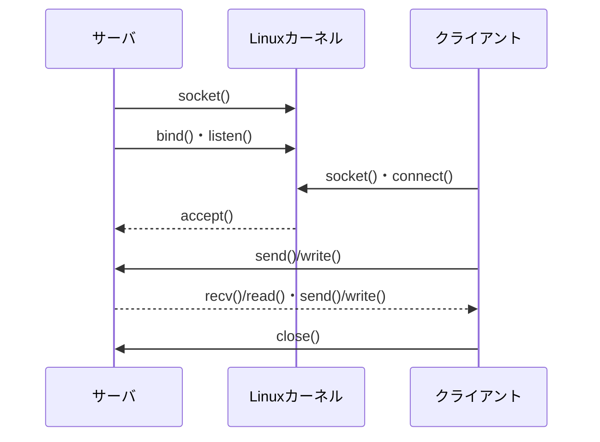

# 第02章 Socket API

**― アプリケーションがカーネルの通信機能を使う窓口 ―**

> この章では、サーバとクライアントがソケットを使って通信する流れを学びます。

------------------------------------------------------------------------

# 1. この章で学べること

- Socket APIが必要な理由
- TCPサーバとクライアントの主要なシステムコール
- ファイルディスクリプタ、待受ソケット、接続済みソケット
- ブロッキングと多重化の概要
- `ss` と `strace` による確認方法

# 2. この章の位置付け

前章ではパケットがソケット受信キューへ届くまでを追いました。本章では、ユーザー空間のアプリケーションがそのデータを読み書きするSocket APIを扱います。

# 3. なぜこの仕組みが必要なのか

アプリケーションごとにTCPやNIC制御を実装すると、安全性と互換性を保てません。Socket APIは、プロトコルやアドレスを指定して通信端点を作り、ファイルに近い操作で読み書きできる共通の窓口を提供します。

# 4. 技術の概要

**ソケット（Socket）**は通信の端点を表すカーネル資源です。プロセスからは**ファイルディスクリプタ（File Descriptor）**という整数で参照します。TCP接続は送信元・宛先のIPアドレスとポート番号、プロトコルの組で識別されます。

# 5. 詳しい仕組み

## TCPサーバとクライアント



サーバは `socket()` でソケットを作り、`bind()` でローカルアドレスとポートへ関連付け、`listen()` で接続待ちにします。`accept()` は一つの接続に対応する新しい接続済みソケットを返します。待受ソケットは次の接続受付に残ります。

クライアントは `connect()` で接続を開始します。TCPではカーネルが3ウェイハンドシェイクを処理し、成功後にアプリケーションがデータを送受信できます。

## UDPソケット

UDPでは通常、接続確立なしで `sendto()` と `recvfrom()` を使います。UDPでも `connect()` を使えますが、TCPのハンドシェイクを行うのではなく、既定の相手をカーネルへ設定する意味です。

## ブロッキングと多重化

データがない間 `recv()` が待つ動作をブロッキングといいます。多数の接続を一つずつ待つと効率が悪いため、Linuxでは `select`、`poll`、`epoll` などで複数ファイルディスクリプタの準備状態を監視できます。

# 6. Linuxではどう利用されるか

```bash
# 待受ソケットとプロセスを確認
ss -lntp

# 接続済みTCPソケットを確認
ss -tnp state established

# テスト用プロセスのネットワークシステムコールを追跡
strace -f -e trace=network curl -I http://192.0.2.80/
```

代表的な出力例（必要な部分のみ抜粋）

```text
$ ss -lntp
LISTEN 0 128 0.0.0.0:8080 0.0.0.0:* users:(("server",pid=3100,fd=3))

$ strace -e trace=network curl -I http://192.0.2.80/
socket(AF_INET, SOCK_STREAM, IPPROTO_TCP) = 5
connect(5, {sa_family=AF_INET, sin_port=htons(80), ...}, 16) = 0
```

確認ポイント

- `fd=3` はプロセスがソケットを参照するファイルディスクリプタです。
- `AF_INET` はIPv4、`SOCK_STREAM` はストリーム型です。
- `connect(...)=0` は接続成功の例です。
- `strace` は性能と機密情報へ影響し得るため、対象と時間を限定します。

# 7. 実務ではどう調査するか

## 障害例：ポート競合で起動できない

二つのプロセスが同じアドレスとポートへ `bind()` しようとすると、設定によっては後から起動した側が失敗します。

```bash
ss -lntp 'sport = :8080'
sudo journalctl -u example-app -n 20
```

代表的な出力例（必要な部分のみ抜粋）

```text
LISTEN 0 128 0.0.0.0:8080 0.0.0.0:* users:(("old-app",pid=2900,fd=7))
example-app[3100]: bind: Address already in use
```

確認ポイント

- 既に待ち受けるPIDと正規のサービスかを確認します。
- 直ちにプロセスを停止せず、依存関係と利用者影響を確認します。

# 8. FE/APではどう問われるか

ソケット、ポート番号、クライアント・サーバ方式、TCPとUDPの違い、待ち行列や多重化の考え方が問われます。API名を暗記するだけでなく、接続確立の前後を理解します。

# 9. まとめ

- Socket APIはユーザー空間からカーネルの通信機能を使う共通窓口です。
- TCPサーバは待受ソケットと接続済みソケットを使い分けます。
- `ss` はカーネルのソケット状態、`strace` はプロセスのシステムコールを観測します。

# 10. 理解度チェック

1. `bind()`、`listen()`、`accept()` の役割を説明してください。
2. 待受ソケットと接続済みソケットの違いは何ですか。
3. UDPの `connect()` がTCPと異なる点を説明してください。

# 11. 解答・解説

## 問1
`bind()` はローカルアドレスへ関連付け、`listen()` は接続待ちへ移行し、`accept()` は個別接続のソケットを返します。

## 問2
待受ソケットは新規接続を受け付け、接続済みソケットは特定相手とのデータ送受信に使います。

## 問3
UDPではハンドシェイクせず、既定の送信先や受信相手をカーネルへ設定します。

# 12. 実務で考えてみよう

## ケース：接続は成立するが応答が遅い

### 解答例

ソケットの送受信キュー、アプリケーションのCPU・待ち状態、依存先への接続を確認します。TCP接続済みという事実と、アプリケーション処理完了を分けて調べます。

# 13. 次章へのつながり

次章では、パケットがLinux内を通る途中でフィルタリングやNATを行うNetfilterを学びます。

------------------------------------------------------------------------

# レビュー状況（執筆メモ）

- 執筆：完了
- レビュー①（章レビュー）：未実施
- レビュー②（部レビュー）：第5部完成後に実施予定
