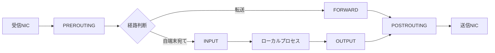

# 第03章 Netfilterとnftables

**― Linux内部の通過点で通信を制御する ―**

> この章では、Netfilterのフックとnftablesによるフィルタリング・NATを学びます。

------------------------------------------------------------------------

# 1. この章で学べること

- Netfilterとnftablesの役割
- INPUT、OUTPUT、FORWARDなどの処理経路
- テーブル、チェーン、ルールの関係
- iptablesとnftablesの位置付け
- 安全なルール調査とトラブルシューティング

# 2. この章の位置付け

前章までに、パケットがカーネルとソケットを通る流れを学びました。本章では、その途中で通信を許可・遮断し、NATを適用するNetfilterを扱います。第4部のファイアウォールをLinux実装へ結び付けます。

# 3. なぜこの仕組みが必要なのか

ルータだけで制御しても、同一ネットワークからの通信やホスト自身が開始する通信は制限できない場合があります。Linux内部の共通経路で制御すれば、アプリケーションを変更せずホスト単位の防御、ルータ機能、NATを実装できます。

# 4. 技術の概要

**Netfilter**はLinuxカーネルのパケット処理へ複数のフックを提供する枠組みです。**nftables**はNetfilterへルールを設定する現在の標準的な仕組みです。`nft` コマンドでテーブル、チェーン、ルールを管理します。

**iptables**は従来から使われてきた管理コマンドとルール体系です。環境によってはiptablesコマンドがnftablesバックエンドを利用します。両者を無計画に混在させず、実際のバックエンドと設定管理元を確認します。

# 5. 詳しい仕組み

## パケット経路とフック



自端末宛て通信はINPUT、自端末が送る通信はOUTPUT、ルータとして転送する通信はFORWARDを通ります。DNATは経路判断前、SNATは送信直前に行う必要があるため、適用位置が重要です。

## テーブル・チェーン・ルール

テーブルはルール群の名前空間、チェーンは処理の列、ルールは一致条件と動作です。基本チェーンにはフック、優先度、デフォルトポリシーを設定します。パケットは優先度とルール順序に従って評価されます。

## コネクショントラッキング

Netfilterの**コネクショントラッキング（Connection Tracking）**は通信状態を記録します。`ct state established,related` により、許可した接続への戻り通信を扱えます。状態表が枯渇すると新規通信へ影響するため、NATや大規模通信では監視が必要です。

# 6. Linuxではどう利用されるか

```bash
# 全ルールをハンドル番号付きで表示
sudo nft -a list ruleset

# iptablesコマンドのバックエンドを確認
iptables --version

# コネクショントラッキングの使用数と上限
sysctl net.netfilter.nf_conntrack_count net.netfilter.nf_conntrack_max
```

代表的な出力例（必要な部分のみ抜粋）

```text
$ sudo nft -a list chain inet filter input
chain input {
  type filter hook input priority filter; policy drop;
  ct state established,related accept # handle 5
  ip saddr 192.0.2.0/24 tcp dport 22 accept # handle 8
}

$ iptables --version
iptables v1.8.9 (nf_tables)

$ sysctl net.netfilter.nf_conntrack_count net.netfilter.nf_conntrack_max
net.netfilter.nf_conntrack_count = 1842
net.netfilter.nf_conntrack_max = 262144
```

確認ポイント

- `hook input` は自端末宛て受信に適用されます。
- `policy drop` はルールに一致しない通信を拒否します。
- `(nf_tables)` はiptables互換コマンドがnftablesを使う例です。
- 状態表は現在数だけでなく、上限への接近と増加傾向を確認します。

# 7. 実務ではどう調査するか

## 障害例：ルール追加後にSSHが切れた

リモート接続中のファイアウォール変更は自分の管理経路を遮断し得ます。適用前に復旧用コンソール、時間指定ロールバック、送信元アドレス、既存接続の扱いを確認します。

```bash
sudo nft list chain inet filter input
ss -tnp 'sport = :22'
sudo journalctl -k --since '10 minutes ago' --grep 'DROP'
```

代表的な出力例（必要な部分のみ抜粋）

```text
chain input { type filter hook input priority filter; policy drop; }
ESTAB 0 0 192.0.2.10:22 198.51.100.20:53000 users:(("sshd",pid=2100,fd=4))
kernel: FW_DROP IN=eth0 SRC=198.51.100.20 DST=192.0.2.10 PROTO=TCP DPT=22
```

確認ポイント

- INPUTチェーンにSSH許可と確立済み通信の許可があるか確認します。
- ログルールは大量出力を避けるためレート制限を検討します。
- 本番ルールを場当たり的に消さず、変更履歴から差分を戻します。

# 8. FE/APではどう問われるか

パケットフィルタリング、ステートフル処理、NAT、デフォルト拒否、ルール順序が問われます。Linux固有のフック名は、ローカル入力・出力・転送の意味と結び付けます。

# 9. まとめ

- Netfilterはカーネルのパケット経路に処理点を提供します。
- nftablesはテーブル、チェーン、ルールでフィルタリングとNATを設定します。
- 調査では通信方向、フック、ルール順序、接続状態を確認します。

# 10. 理解度チェック

1. INPUT、OUTPUT、FORWARDの違いを説明してください。
2. コネクショントラッキングは何に使われますか。
3. iptablesとnftablesが混在するとき何を確認しますか。

# 11. 解答・解説

## 問1
INPUTは自端末宛て、OUTPUTは自端末発、FORWARDは端末を通過して転送される通信です。

## 問2
通信状態を記録し、確立済み通信の戻りやNATの対応を判断するために使います。

## 問3
iptablesコマンドのバックエンド、実際の全ルール、設定を管理するサービスやツールを確認します。

# 12. 実務で考えてみよう

## ケース：サーバ自身からは接続できるが外部からは失敗する

### 解答例

待受アドレス、INPUTルール、境界側ルール、戻り経路を確認します。ローカル接続は外部と同じINPUT経路を通らない場合があるため、成功を外部到達性の証明にしません。

# 13. 次章へのつながり

次章では、実際のパケットをtcpdumpとWiresharkで観測し、各段階の推測を事実に変える方法を学びます。

------------------------------------------------------------------------

# レビュー状況（執筆メモ）

- 執筆：完了
- レビュー①（章レビュー）：未実施
- レビュー②（部レビュー）：第5部完成後に実施予定
