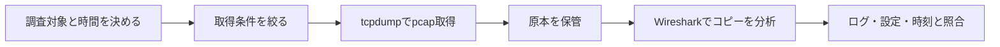

# 第04章 tcpdumpとWireshark

**― パケットを観測して通信の事実を確かめる ―**

> この章では、安全なパケット取得と、通信シーケンスの読み方を学びます。

------------------------------------------------------------------------

# 1. この章で学べること

- tcpdumpとWiresharkの役割分担
- キャプチャフィルタと表示フィルタ
- DNS、TCP、TLS、HTTPの流れの読み方
- 観測場所による見え方の違い
- パケット取得時の安全上の注意

# 2. この章の位置付け

前章ではNetfilterがパケット経路へ介入する仕組みを学びました。本章では、パケットが実際に到着・送信されたかを観測し、DNSからアプリケーションまでの流れを確認します。

# 3. なぜこの仕組みが必要なのか

ログや設定だけでは、通信がどこまで進んだか分からない場合があります。パケットキャプチャは、SYNを送ったか、応答が返ったか、再送が起きたかを時系列で示します。ただし、観測地点に届かない通信は見えず、暗号化された内容も復号なしでは読めません。

# 4. 技術の概要

**tcpdump**はLinux上でパケットを取得・表示するコマンドです。端末上で短時間の調査を行い、pcap形式で保存できます。**Wireshark**はpcapを詳しく解析し、プロトコルのフィールド、会話、再送、応答時間などをGUIで確認するツールです。

# 5. 詳しい仕組み

## 取得から分析まで



**キャプチャフィルタ（Capture Filter）**は取得するパケット自体を絞り、tcpdumpとWiresharkでBPF構文を使います。**表示フィルタ（Display Filter）**は取得済みパケットの表示だけを絞るWireshark独自の構文です。

| 目的 | キャプチャフィルタ例 | Wireshark表示フィルタ例 |
|---|---|---|
| DNS | `port 53` | `dns` |
| 特定ホスト | `host 192.0.2.80` | `ip.addr == 192.0.2.80` |
| TCP SYN | `tcp`で取得後に分析 | `tcp.flags.syn == 1` |
| TCP再送 | `tcp`で取得後に分析 | `tcp.analysis.retransmission` |

## 観測場所とオフロード

クライアント、サーバ、経路上では見えるパケットが異なります。NATの前後ではIPアドレスも変わります。またNICのチェックサム・分割・結合オフロードにより、ホスト上のキャプチャが実際の回線上と異なって見えることがあります。チェックサム異常表示だけで障害と断定しません。

## 暗号化通信

TLSやSSHではIPアドレス、ポート、パケット長、タイミング、ハンドシェイクの一部は見えますが、アプリケーションデータは暗号化されています。内容を確認するために本番の秘密鍵や認証情報を不用意に持ち出してはいけません。

# 6. Linuxではどう利用されるか

```bash
# 対象と件数を限定して画面表示
sudo tcpdump -ni any -nn -c 10 'host 192.0.2.80 and tcp port 443'

# DNS通信をpcapへ保存
sudo tcpdump -ni eth0 -nn -s 0 -c 100 -w dns-check.pcap 'port 53'

# pcapの概要を読み直す
tcpdump -nn -r dns-check.pcap
```

代表的な出力例（必要な部分のみ抜粋）

```text
$ sudo tcpdump -ni any -nn -c 4 'host 192.0.2.80 and tcp port 443'
192.0.2.10.53000 > 192.0.2.80.443: Flags [S], seq 1000
192.0.2.80.443 > 192.0.2.10.53000: Flags [S.], seq 5000, ack 1001
192.0.2.10.53000 > 192.0.2.80.443: Flags [.], ack 5001
192.0.2.10.53000 > 192.0.2.80.443: Flags [P.], length 517
```

確認ポイント

- `-nn` は名前とポートの変換を行わず数値で表示します。
- `[S]`、`[S.]`、`[.]` でTCP接続確立を確認します。
- `[P.]` のデータ内容はTLS利用時には暗号化されています。
- `any` は便利ですが、方向やリンク層情報の解釈に注意します。

# 7. 実務ではどう調査するか

## 障害例：TCP接続がときどき遅い

```bash
sudo tcpdump -ni eth0 -nn -tttt -c 20 'host 192.0.2.80 and tcp port 443'
```

代表的な出力例（必要な部分のみ抜粋）

```text
2026-07-21 15:00:00.000 192.0.2.10.53000 > 192.0.2.80.443: Flags [S]
2026-07-21 15:00:01.024 192.0.2.10.53000 > 192.0.2.80.443: Flags [S]
2026-07-21 15:00:01.040 192.0.2.80.443 > 192.0.2.10.53000: Flags [S.]
```

確認ポイント

- 約1秒後にSYNが再送されています。
- クライアント側だけでは最初のSYNと応答のどちらが失われたか断定できません。
- 両端または経路上の観測と、インターフェース統計を組み合わせます。

# 8. FE/APではどう問われるか

プロトコルシーケンス、ヘッダ、再送、暗号化範囲、監視方式が問われます。キャプチャ結果から正常に進んだ段階と停止箇所を読み取ります。

# 9. まとめ

- tcpdumpは取得、Wiresharkは詳細分析に適します。
- フィルタ、時間、対象を絞り、機密情報を安全に扱います。
- 一か所のキャプチャだけでパケット損失区間を断定しません。

# 10. 理解度チェック

1. キャプチャフィルタと表示フィルタの違いは何ですか。
2. SYN再送から分かることと分からないことを説明してください。
3. TLS通信のキャプチャで通常確認できる情報を挙げてください。

# 11. 解答・解説

## 問1
キャプチャフィルタは取得対象そのもの、表示フィルタは取得済みデータの表示を絞ります。

## 問2
送信側が一定時間応答を確認できなかったことは分かりますが、要求と応答のどちらがどこで失われたかは一地点だけでは断定できません。

## 問3
IPアドレス、ポート、長さ、時刻、TCP状態、TLSハンドシェイクの一部などです。

# 12. 実務で考えてみよう

## ケース：pcapを外部の担当者へ渡したい

### 解答例

認証情報、個人情報、社内アドレスなどの含有を確認し、組織の承認と安全な受け渡し方法に従います。必要区間だけを取得し、原本を保管したうえで共有用コピーを最小化します。

# 13. 次章へのつながり

次章では、パケットを取得するだけでなく、カーネル内の特定処理を安全に観測・制御するeBPF、XDP、tcを学びます。

------------------------------------------------------------------------

# レビュー状況（執筆メモ）

- 執筆：完了
- レビュー①（章レビュー）：未実施
- レビュー②（部レビュー）：第5部完成後に実施予定
