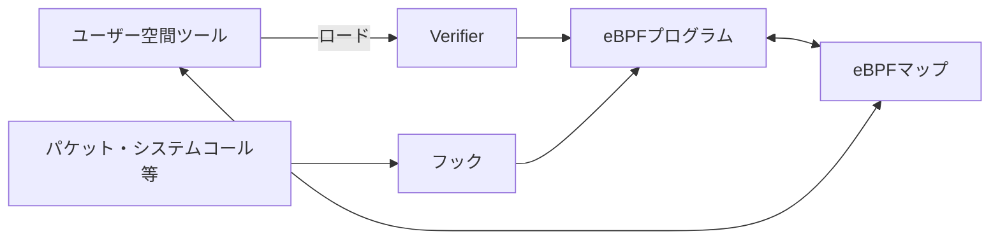

# 第05章 eBPF・XDP・tc

**― カーネル内の適切な位置で通信を観測・処理する ―**

> この章では、eBPFの基本とXDP・tcの処理位置、実務での安全な利用を学びます。

------------------------------------------------------------------------

# 1. この章で学べること

- eBPFが必要になった背景
- eBPFプログラム、フック、マップ、ユーザー空間の関係
- XDPとtcの処理位置と用途
- bpftoolとtcによる確認方法
- 高度な観測を使う際の注意点

# 2. この章の位置付け

前章では完成したパケットをtcpdumpで観測しました。本章では、Linuxカーネル内のイベントやパケット処理点へ小さなプログラムを取り付け、観測・集計・制御するeBPFを扱います。

# 3. なぜこの仕組みが必要なのか

従来のログやパケットキャプチャだけでは、どのカーネル関数で遅れたか、どのプロセスが接続を開始したかを十分に関連付けられない場合があります。カーネルモジュールは強力ですが、不具合がOS全体へ影響し、開発・配布の負担も大きくなります。

eBPFは、検証されたプログラムを許可されたフックで実行し、カーネルを作り直さず観測や処理を追加する仕組みを提供します。

# 4. 技術の概要

**eBPF（extended Berkeley Packet Filter）**は、Linuxカーネル内のフックでサンドボックス化されたプログラムを実行する仕組みです。ロード時には**Verifier**が安全性を検査します。

**eBPFマップ（eBPF Map）**は、eBPFプログラムとユーザー空間が統計や設定を共有するデータ構造です。ユーザー空間のツールはプログラムをロードし、マップから結果を読み取ります。

# 5. 詳しい仕組み

## 全体構成



## XDP

**XDP（eXpress Data Path）**は受信パケットをネットワークスタックの早い段階で処理します。パケットを通す `XDP_PASS`、破棄する `XDP_DROP`、別インターフェース等へ転送する `XDP_REDIRECT` などを返します。早期処理に向きますが、アプリケーションやTCP状態がまだ見えない位置です。

## tc

**tc（Traffic Control）**はLinuxのトラフィック制御機能です。ingressとegressで分類、帯域制御、遅延・損失の模擬、eBPFプログラムの取り付けなどを行えます。XDPより後の処理位置で、送信方向にも適用できます。

| 観点 | XDP | tc |
|---|---|---|
| 主な位置 | 受信の非常に早い段階 | ingress・egress |
| 強み | 高速な破棄・転送 | 送受信の分類・制御 |
| 注意点 | 利用できる情報が早期段階に限定 | qdiscと既存設定への影響 |

## 可観測性のフック

トレースポイント、kprobe、uprobesなどを使うと、パケット以外にシステムコールや関数実行も観測できます。内部関数へ依存する方法はカーネル更新の影響を受けやすいため、安定したトレースポイントやBTFを利用できるか確認します。

# 6. Linuxではどう利用されるか

```bash
# ロード済みeBPFプログラムを表示
sudo bpftool prog list

# eBPFマップを表示
sudo bpftool map list

# インターフェースのXDP取り付け状態
ip -details link show dev eth0

# tcのフィルタを表示
sudo tc filter show dev eth0 ingress
```

代表的な出力例（必要な部分のみ抜粋）

```text
$ sudo bpftool prog list
42: xdp name xdp_monitor tag a1b2c3d4 gpl
    loaded_at 2026-07-21T15:20:00+0900 uid 0

$ ip -details link show dev eth0
2: eth0: <BROADCAST,MULTICAST,UP,LOWER_UP> mtu 1500 xdp id 42

$ sudo tc filter show dev eth0 ingress
filter protocol all pref 10 bpf chain 0 handle 0x1 xdp_stats direct-action
```

確認ポイント

- プログラムID、種類、名前、ロード時刻、所有者を確認します。
- `xdp id 42` はeth0へID 42のXDPプログラムが付いている例です。
- tcでは対象方向、優先度、プログラム名を確認します。
- 出所不明のeBPFプログラムを特権でロードしません。

# 7. 実務ではどう調査するか

## 障害例：XDP導入後に特定通信だけ消えた

早い段階で `XDP_DROP` されたパケットは通常のネットワークスタックやホスト上のtcpdumpへ届かない場合があります。導入前後の統計、XDPマップ、別地点のキャプチャを確認します。

```bash
ip -details link show dev eth0
sudo bpftool map dump id 17
nstat -az IpInReceives
```

代表的な出力例（必要な部分のみ抜粋）

```text
xdp id 42
key: 01 00 00 00  value: e8 03 00 00 00 00 00 00
IpInReceives  12480
```

確認ポイント

- マップのキーと値はプログラム定義がなければ意味を判断できません。
- NICでは受信するが `IpInReceives` が増えない場合、より早い処理点を疑います。
- 切り戻し手順を準備し、観測プログラム自体の負荷も測定します。

# 8. FE/APではどう問われるか

eBPFやXDPは試験で詳細実装まで問われない場合でも、カーネルとユーザー空間、パケット処理位置、監視と制御の違いを理解する題材になります。安全性検証と最小権限も重要です。

# 9. まとめ

- eBPFは検証済みプログラムをカーネルのフックで実行します。
- XDPは受信早期、tcはingress・egressでパケットを扱います。
- 観測位置が早いほど高速ですが、利用できる文脈は限られます。

# 10. 理解度チェック

1. eBPFのVerifierとマップの役割を説明してください。
2. XDPとtcの処理位置の違いは何ですか。
3. XDPで破棄した通信がtcpdumpに見えない場合があるのはなぜですか。

# 11. 解答・解説

## 問1
Verifierはロード前にプログラムの安全性を検査し、マップはカーネル内プログラムとユーザー空間でデータを共有します。

## 問2
XDPは受信の非常に早い段階、tcはネットワークスタック上のingress・egressで処理します。

## 問3
tcpdumpが観測する処理点へ届く前にXDPが破棄する可能性があるためです。

# 12. 実務で考えてみよう

## ケース：本番サーバへ観測用eBPFを導入する

### 解答例

対象カーネルとの互換性、権限、取得データ、CPU・メモリ負荷、保持期間、切り戻しを確認します。まず検証環境で負荷試験し、本番では対象と時間を限定して監視します。

# 13. 次章へのつながり

最終章では、これまでの `ip`、`ss`、tcpdump、ログ、eBPFを組み合わせ、障害を順序立てて切り分けます。

------------------------------------------------------------------------

# レビュー状況（執筆メモ）

- 執筆：完了
- レビュー①（章レビュー）：未実施
- レビュー②（部レビュー）：第5部完成後に実施予定
