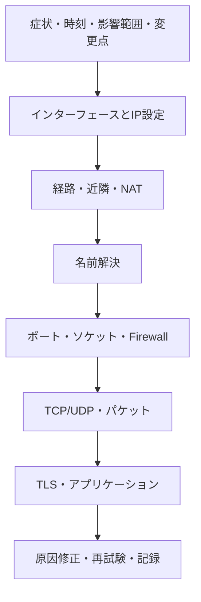

# 第06章 ネットワークトラブルシューティング

**― 症状を層と時系列に分け、事実から原因へ近づく ―**

> この章では、本書全体の知識とLinuxツールを使った調査手順を学びます。

------------------------------------------------------------------------

# 1. この章で学べること

- 再現条件、期待値、変更点を整理する方法
- 下位層から上位層へ確認する手順
- `ip`、`ss`、`dig`、`curl`、tcpdump、ログの役割分担
- 正常時との比較と両端観測
- 調査記録と安全な変更

# 2. この章の位置付け

本章は第1～5部の総まとめです。「Webページが開かない」という症状を、Linux内部のパケット処理、プロトコル、セキュリティ制御、アプリケーションへ分解します。

# 3. なぜこの考え方が必要なのか

通信障害は、ケーブル、IP設定、DNS、経路、Firewall、TCP、TLS、アプリケーションなど、異なる原因が似た症状を生みます。思いついた設定を次々に変えると、原因を隠し、新しい障害を作ります。

期待する通信、再現条件、正常時との差を記録し、一つの確認で分かる範囲を意識して進める必要があります。

# 4. 技術の概要

トラブルシューティングでは、仮説を立て、観測し、結果に応じて次の仮説を選びます。成功した段階は下位の一部が機能した証拠ですが、すべてが正常という証明ではありません。例えばHTTP 500を受け取れればDNS・TCP・TLSは概ね進んでいますが、Webアプリケーションは失敗しています。

# 5. 詳しい仕組み

## 調査フロー



## まず条件を固定する

- 誰が、どの端末から、どの宛先へ接続したか
- いつから、常時か断続的か、全員か一部か
- 正常時の期待値と実際の結果
- 直前の構成、証明書、経路、アプリケーション変更

コマンドの結果には実行時刻を付けます。DNSキャッシュや負荷で条件が変わるため、比較時は同じ宛先・手順を使います。

## ツールの役割

| 確認対象 | 主なツール | 分かること |
|---|---|---|
| インターフェース・IP | `ip address`、`ip link` | アドレス、状態、MTU |
| 経路・近隣 | `ip route get`、`ip neigh` | 出力経路、次ホップ、近隣解決 |
| 名前解決 | `getent`、`dig` | OSの結果、DNS応答 |
| ソケット | `ss` | 待受、接続状態、キュー |
| アプリケーション | `curl`、サービスログ | 段階別接続、応答 |
| パケット | tcpdump、Wireshark | 実際の送受信と時系列 |
| カーネル内部 | `nstat`、eBPF系ツール | 統計、破棄、特定イベント |

## 観測してから変更する

変更前の設定と結果を保存し、一度に一要素だけ変えます。検証後は期待どおり改善したか、副作用がないか、設定が再起動後も維持されるかを確認します。

# 6. Linuxではどう利用されるか

```bash
date -Is
ip -br link
ip -br address
ip route
ip route get 192.0.2.80
ip neigh show
getent ahosts service.example.com
ss -lntp
curl -vI https://service.example.com/
```

代表的な出力例（必要な部分のみ抜粋）

```text
2026-07-21T16:00:00+09:00
eth0 UP 192.0.2.10/24
default via 192.0.2.1 dev eth0
192.0.2.80 via 192.0.2.1 dev eth0 src 192.0.2.10
192.0.2.80 STREAM service.example.com
* Connected to service.example.com port 443
* SSL connection using TLSv1.3
< HTTP/2 503
```

確認ポイント

- IP設定、経路、名前解決、TCP、TLSの順に成功しています。
- HTTP 503はサービスが要求を処理できない状態を示します。
- この結果だけなら、ネットワーク設定変更よりWeb・依存サービスのログを優先します。

# 7. 実務ではどう調査するか

## 総合例：名前解決はできるが接続がタイムアウトする

```bash
getent ahosts service.example.com
ip route get 192.0.2.80
ss -tn state syn-sent
sudo tcpdump -ni any -nn -c 6 'host 192.0.2.80 and tcp port 443'
```

代表的な出力例（必要な部分のみ抜粋）

```text
192.0.2.80 STREAM service.example.com
192.0.2.80 via 192.0.2.1 dev eth0 src 192.0.2.10
SYN-SENT 192.0.2.10:53000 192.0.2.80:443
192.0.2.10.53000 > 192.0.2.80.443: Flags [S]
192.0.2.10.53000 > 192.0.2.80.443: Flags [S]
```

確認ポイント

- DNSとローカル経路選択は成功しています。
- SYNを再送していますがSYN+ACKは観測できません。
- クライアント送信後の経路、Firewall、サーバ待受、戻り経路を両端で確認します。

## 現場ではこう考える

「pingが通る」はICMPへの応答、「ポートが開く」はトランスポート接続、「HTTP 200」はアプリケーション応答の一例です。一つの試験結果を別の層へ一般化しません。また、障害中にセキュリティ機能を全面無効化せず、対象と時間を限定した検証を行います。

# 8. FE/APではどう問われるか

OSI/TCP-IP各層、DNS、ARP、経路、TCP状態、HTTPコード、ログ分析などを組み合わせた問題として問われます。どの情報から何が確定し、何が未確認かを整理します。

# 9. まとめ

- 症状、時刻、影響範囲、期待値、変更点を最初に整理します。
- 下位から上位へ観測し、各ツールで分かる範囲を超えて断定しません。
- 変更前後を比較し、結果と副作用を記録します。

# 10. 理解度チェック

1. HTTP 503を受信したとき、どの段階まで進んだと考えられますか。
2. SYN再送だけが見える場合、次にどこを確認しますか。
3. 障害調査で一度に一要素だけ変更する理由は何ですか。

# 11. 解答・解説

## 問1
名前解決、経路、TCP、HTTPSならTLS、HTTP応答までは進んでいます。アプリケーションや依存先を優先して調べます。

## 問2
送信後の経路、Firewall、サーバ待受、戻り経路を、可能ならサーバ側や中間地点でも観測します。

## 問3
どの変更が結果へ影響したか判断できるようにし、新しい障害と原因の隠蔽を避けるためです。

# 12. 実務で考えてみよう

## ケース：断続的な障害で調査時には正常になる

### 解答例

正常時の基準値を用意し、時刻付きの軽量なメトリクスとログを継続収集します。発生条件、負荷、接続先、経路、再送、キューを同じ時間軸で比較し、常時の詳細キャプチャによる容量・機密性への影響を避けます。

# 13. 次章へのつながり

本章で、ネットワークの基礎からLinux内部の観測と実務調査までを一つの流れとして結びました。今後は対象システムの設計・正常値・運用手順を加え、自分の環境に合う調査手順へ育ててください。

------------------------------------------------------------------------

# レビュー状況（執筆メモ）

- 執筆：完了
- レビュー①（章レビュー）：未実施
- レビュー②（部レビュー）：第5部完成後に実施予定
